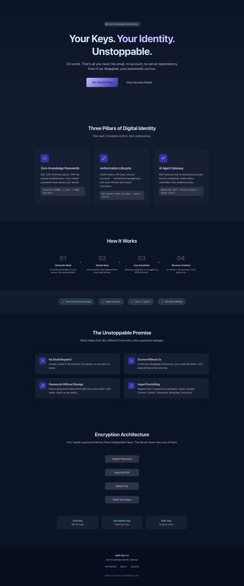
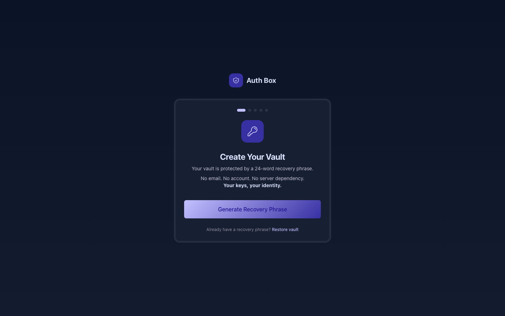
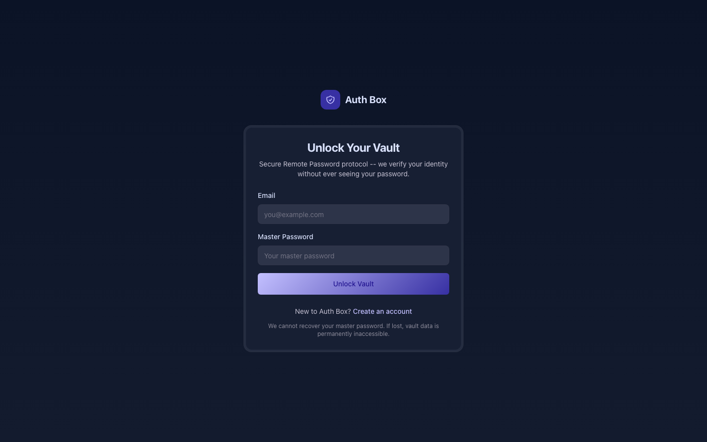
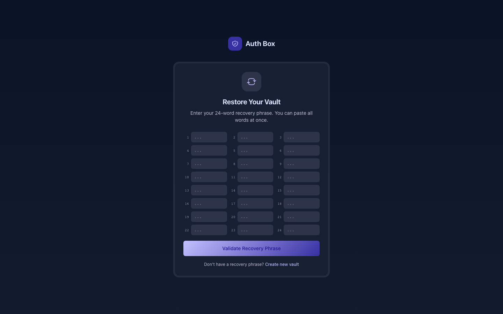

<p align="center">
  
</p>

<p align="center">
  <strong>Your Keys. Your Identity. Unstoppable.</strong>
</p>

<p align="center">
  <a href="LICENSE"></a>
  
  
  
  
  
</p>

---

The password manager that works even if we disappear. 24 words = all your passwords. No email, no account, no server dependency.

[](https://glama.ai/mcp/servers/MARUCIE/authbox)

## Why Auth Box

Every password manager asks you to trust them. Auth Box asks you to trust **math**.

- **No Email Required** -- Create a vault in 45 seconds. Just a seed phrase and a master password.
- **Survive Without Us** -- Your vault is encrypted with keys derived from your seed phrase. Even if Auth Box ceases to exist, your passwords remain yours.
- **Passwords Without Storage** -- Derive passwords deterministically from your seed + site name. Your vault can literally be empty.
- **AI Agent Gateway** -- Give AI assistants controlled access to credentials via MCP protocol, with policy-gated, auditable delegation.
- **Import Everything** -- Migrate from 13 sources: Apple, Google, Chrome, Edge, Firefox, 1Password, Bitwarden, LastPass, Dashlane, KeePass, Samsung Pass, NordPass, Enpass.
- **AI Infrastructure Hub** -- Manage API keys for 70+ providers (OpenAI, Anthropic, AWS, Stripe...). Drag-drop .env files to auto-import. One-click health checks verify keys are valid.
- **Arweave Permanent Storage** -- Archive your encrypted vault to Arweave for permanent, decentralized backup. Recovery works even without Auth Box servers.

## The Unstoppable Promise

```
You trust your crypto to 24 words. Why not your passwords?
```

Auth Box uses the same proven model as Bitcoin wallets:

```
seed phrase (24 words)
  -> master key (PBKDF2-HMAC-SHA512)
    -> vault encryption key
    -> sync encryption key
    -> per-agent delegation keys
    -> deterministic passwords (no storage needed)
```

If you have your seed phrase, you have everything. No server. No company. No dependency.

## Screenshots

<p align="center">
  
  
</p>

<p align="center">
  
</p>

## Quick Start

```bash
# Install dependencies
pnpm install

# Start development
make dev        # Postgres + Redis + Web
make dev-api    # Go API
make dev-full   # Everything at once
```

- Web app: http://localhost:3010
- API: http://localhost:4010

## Architecture

```
Client (holds all keys)              Server (encrypted blobs only)
+-----------------------------+      +---------------------------+
| Web App     Extension       | E2E  | Auth (SRP-6a)             |
| (Next.js)   (Chrome MV3)   | ---> | Vault (encrypted CRUD)    |
|                             |      | Agents + Policies (JSONB) |
| @authbox/crypto (seed+HD)  |      | Audit (hash chain)        |
| MCP Gateway (WebSocket)    |      | PostgreSQL + Redis        |
+-----------------------------+      +---------------------------+
```

**Zero-knowledge**: The server stores only encrypted blobs. It cannot decrypt anything.

**Unstoppable Mode**: The server is optional. Your vault works offline with keys derived from your seed phrase.

## Monorepo Structure

```
packages/
  crypto/           @authbox/crypto     -- BIP-39 seed, HD keys, Argon2id, AES-256-GCM, SRP-6a
  shared/           @authbox/shared     -- Types, validation schemas
  mcp-protocol/     @authbox/mcp-protocol -- AI gateway (MCP over WebSocket)
apps/
  web/              @authbox/web        -- Next.js 15, Vault Onyx design system
  console/          auth-box-console    -- Public portal + admin dashboard
  extension/        auth-box-extension  -- Chrome MV3 (popup + content + background)
services/
  api/              auth-box-api        -- Go API (chi v5, pgx v5, DDD layered)
```

## Encryption

| Layer | Primitive | Purpose |
|-------|-----------|---------|
| Seed | BIP-39 (24 words) | Sole recovery mechanism |
| Master Key | PBKDF2-HMAC-SHA512 | Key derivation from seed |
| Sub-keys | HD derivation (BIP-32 style) | vault / sync / agent / auth / derive |
| Vault | AES-256-GCM | Encrypt all vault items |
| Auth | SRP-6a | Mutual authentication (optional server) |
| Passwords | Deterministic derivation | seed + site = password (no storage) |

## Comparison

| Feature | 1Password | Bitwarden | LessPass | Apple Keychain | **Auth Box** |
|---------|-----------|-----------|----------|----------------|-------------|
| Self-sovereign (seed phrase) | No | No | No | No | **Yes** |
| Works without server | No | Self-host only | Yes | Apple only | **Yes** |
| Deterministic passwords | No | No | Yes | No | **Yes** |
| Full vault + deterministic hybrid | No | No | No | No | **Yes** |
| AI Agent gateway (MCP) | No | No | No | No | **Yes** |
| Open source client | No | Yes | Yes | No | **Yes (MIT)** |
| Import sources | Few | 8 | 0 | Apple only | **13 + .env auto-import** |
| AI API key management | No | No | No | No | **70+ providers** |
| Company disappears | Data at risk | Self-host option | OK (stateless) | Locked | **24 words = recovery** |

## Tests

Latest verified baseline (2026-03-23):

```text
Go API:     PASS   28 tests (SRP/TOTP, rate limiter, security middleware, audit chain)
Crypto:     PASS   51 deterministic tests; 2 live Arweave probes opt-in
E2E:        65/65  Real SRP/TOTP login + vault/agent/audit/session CRUD + security
Build:      PASS   7/7 turbo packages, 0 errors
```

Security audit: 12 findings fixed (TOTP bypass, timing attack, session scoping, CORS hardening...)
Performance audit: 11 optimizations applied (composite indexes, cache limits, rate limiter refactor...)

## Key Commands

| Command | Description |
|---------|-------------|
| `make dev` | Start infra + web dev server |
| `make dev-api` | Start Go API |
| `make dev-full` | Start everything |
| `make build` | Build all packages |
| `make test` | Run all tests |
| `make test-api` | Run the Go API test suite |
| `make test-crypto` | Run the crypto package test suite |
| `npx tsx scripts/e2e-test.mjs [api-base]` | Run E2E suite against a real API |

## Contributing

See [CONTRIBUTING.md](CONTRIBUTING.md) for development setup and guidelines.

Auth Box is MIT licensed. PRs welcome.

## License

[MIT](LICENSE) -- Use it, fork it, build on it.

---

Maurice | maurice_wen@proton.me