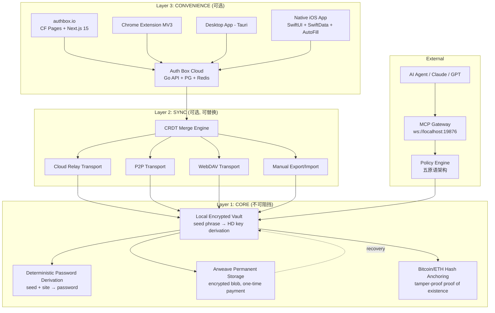
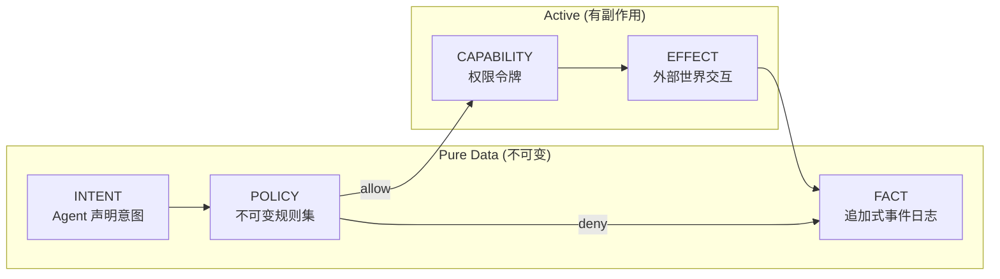
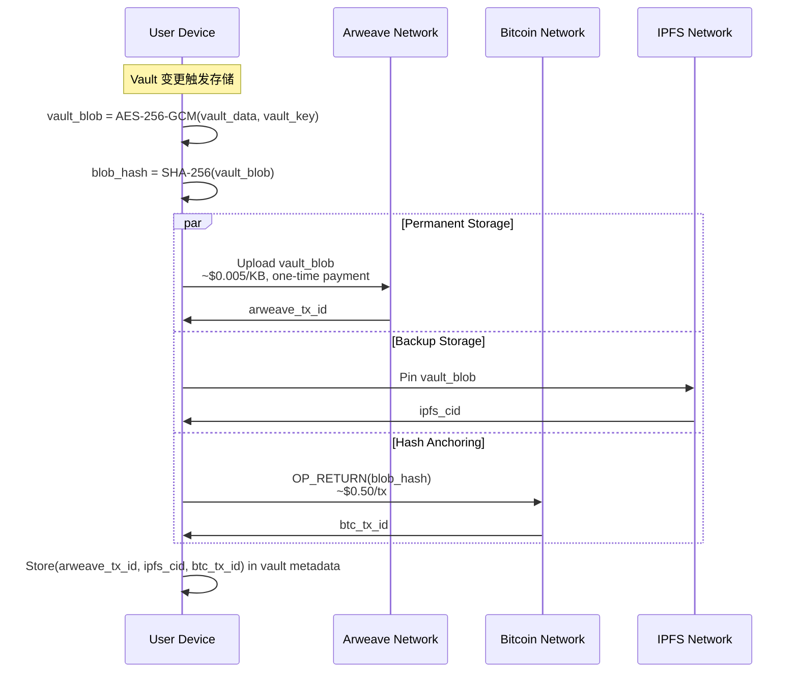
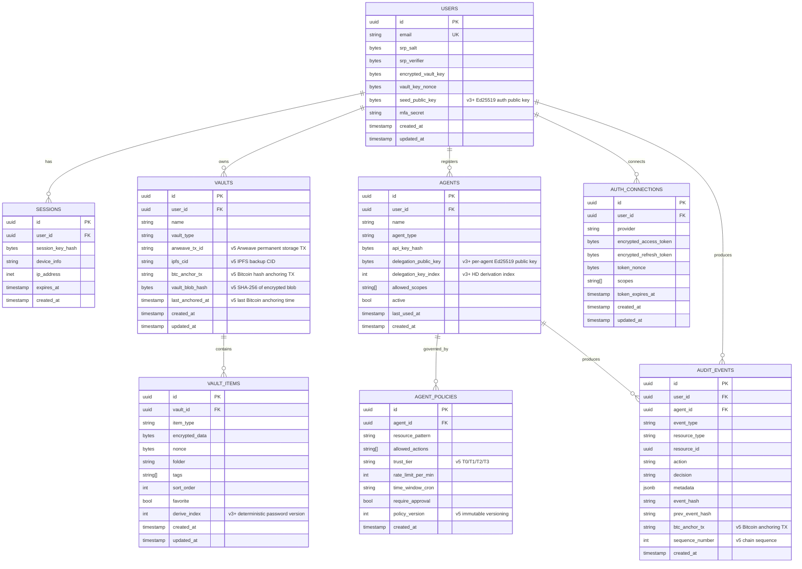
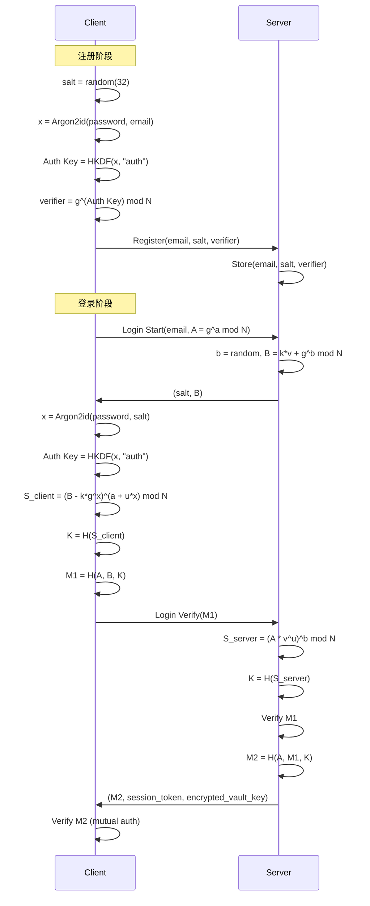
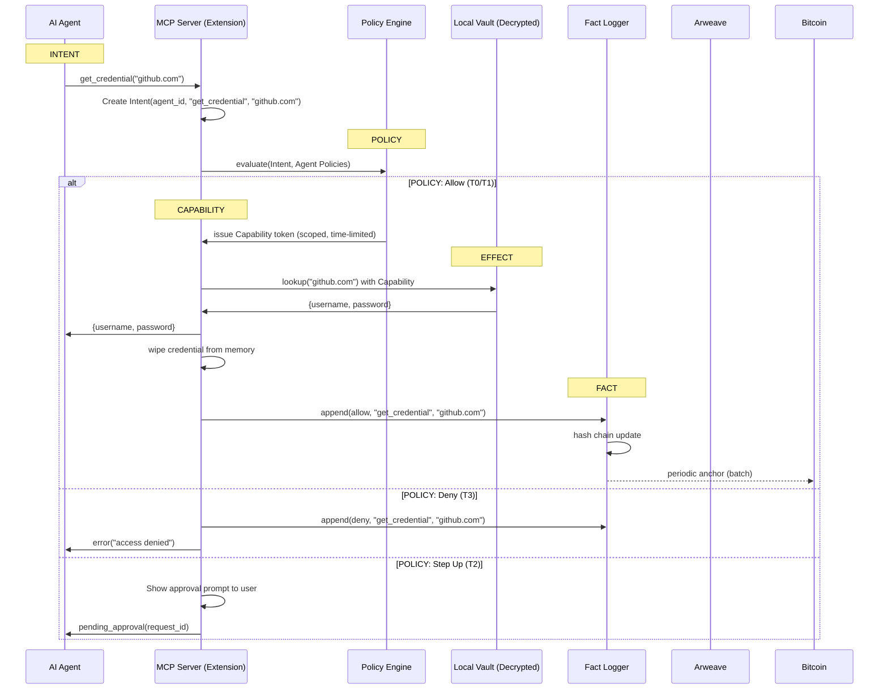
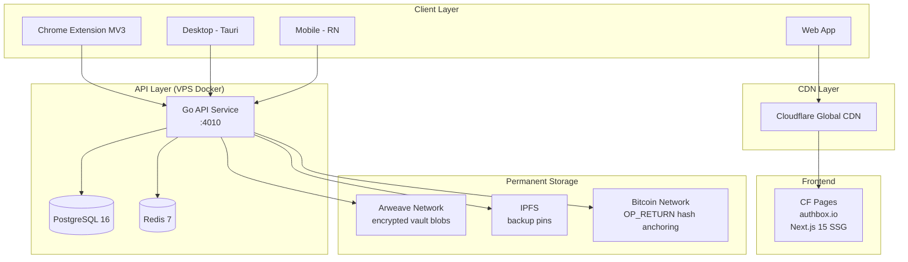

<!-- AI-TOOLS:PROJECT_DIR:BEGIN -->
- **PROJECT_DIR**: `/Users/mauricewen/Projects/10-auth-box`
- **VERIFIED_AT_UTC**: `2026-05-31T01:25:30Z`
- **RULE**: Always run tasks against the project root. If the CLI detects a mismatch, it will update this block.
<!-- AI-TOOLS:PROJECT_DIR:END -->

# 系统架构 - Auth Box v5 (Unstoppable Edition)

## 1. 概览

Auth Box v5 在零知识架构基础上演进为 **不可阻挡架构**：即使公司倒闭、服务器下线、设备丢失，用户仅凭一张纸上的 24 个助记词即可恢复全部凭据。

核心原则：

- **零知识架构**：加密/解密全部在客户端完成，服务端永远无法解密任何凭据
- **种子词主权**：BIP-39 助记词（24 词）是唯一恢复机制，取代 Master Password 的单点依赖
- **本地优先**：Vault 离线可用，服务器仅为可选同步层
- **永久存储**：Arweave 存储加密 Vault Blob（一次付费、永久保存），Bitcoin/ETH 锚定哈希（防篡改证明）
- **五原语架构**：Capability / Intent / Policy / Effect / Fact，构建 Agent 凭据治理的最小完备模型

## 2. 架构演进 (v1 -> v5)

| 版本 | 架构范式 | 核心能力 | 状态 |
|------|---------|---------|------|
| v1 | Flat CRUD | 基础密码管理，服务端加密 | DONE |
| v2 | DDD + Zero-Knowledge + MCP Gateway | 客户端加密、SRP-6a 认证、AI Agent 凭据网关 | DONE |
| v3 | Seed Phrase Sovereignty + Deterministic Passwords | BIP-39 助记词、HD 密钥派生、确定性密码生成 | PLANNED |
| v4 | Cryptographic Identity | Passkeys (WebAuthn) + DID 去中心化身份 | PLANNED |
| v5 | Permanent Decentralized Storage | Arweave 永久存储 + Bitcoin 哈希锚定 | PLANNED |

每个版本向下兼容前一版本的数据，但不维护兼容代码层。升级即迁移，迁移即单向。

## 3. 高层架构



三层设计的关键洞察：**从外向内逐层剥离，核心层零依赖**。

- Layer 3 倒了 → Layer 1+2 继续工作（本地 + P2P/WebDAV 同步）
- Layer 2 倒了 → Layer 1 继续工作（纯本地 + 手动导出）
- Layer 1 设备丢了 → 助记词 + Arweave = 完整恢复

## 3.1 Native iOS Baseline (2026-05-31)

The repository now contains a native iOS workspace at `apps/ios`.

| Layer | Path | Role | Verification |
|---|---|---|---|
| App shell | `apps/ios/AuthBox` | SwiftUI onboarding, vault, generator, settings, local app state | `xcodebuildmcp build_sim` PASS |
| Local storage | `apps/ios/AuthBox/Sources/Core/Storage` | SwiftData vault items + Keychain seed protection | `FullFlowUITests.testFullOnboardingAndVaultFlow` PASS |
| AutoFill | `apps/ios/AutoFillExtension` | iOS Credential Provider extension using shared app group | `xcodebuildmcp test_sim` PASS |
| Crypto package | `apps/ios/AuthBoxCrypto` | SwiftPM package mirroring `@authbox/crypto` seed, HKDF, AES-GCM, SRP, Argon2 | `swift test` 62/62 PASS |
| Cross-platform vectors | `apps/ios/cross-platform-test.ts` | TypeScript source-of-truth vectors for Swift assertions | `pnpm run ios:crypto-vectors` PASS |

Scope boundary: this is a local iOS baseline only. It does not change the public release gate, Cloudflare Pages deployment, GitHub remote state, or VPS production state.

## 4. 密钥派生体系

v5 将密钥派生从 Master Password 迁移到 BIP-39 助记词，采用 HD (Hierarchical Deterministic) 分层确定性派生：

```
seed phrase (BIP-39, 24 words)
  → master key (PBKDF2-HMAC-SHA512, 2048 iterations)
    → m/ABX'/vault'/0'    → vault encryption key (AES-256-GCM)
    → m/ABX'/sync'/0'     → sync encryption key
    → m/ABX'/auth'/0'     → authentication signing key (Ed25519)
    → m/ABX'/agent'/n'    → per-agent delegation key (revocable)
    → m/ABX'/derive'/n'   → deterministic password derivation
```

### 派生路径说明

| 路径 | 用途 | 算法 | 轮换策略 |
|------|------|------|---------|
| `m/ABX'/vault'/0'` | 加密本地 Vault 和 Arweave Blob | AES-256-GCM | 不轮换（助记词不变） |
| `m/ABX'/sync'/0'` | 加密同步传输数据 | AES-256-GCM | 按需轮换（index 递增） |
| `m/ABX'/auth'/0'` | 签名认证请求（替代 SRP-6a） | Ed25519 | 不轮换 |
| `m/ABX'/agent'/n'` | 为每个 AI Agent 派生独立密钥 | Ed25519 | 可单独撤销（标记 index 为废弃） |
| `m/ABX'/derive'/n'` | 确定性密码生成（seed + domain → password） | HKDF-SHA256 | index = 密码版本号 |

### 确定性密码生成

```
derive_key = HKDF(master_key, "derive")
password = Base62(HMAC-SHA256(derive_key, domain + ":" + username + ":" + version))[:length]
```

优势：无需存储密码本体。只要记住助记词 + 知道域名，即可在任何设备上重新推导出密码。

### 向后兼容：Master Password 迁移路径

v2 用户升级到 v3+ 时：
1. 用 Master Password 解锁现有 Vault
2. 生成新的 BIP-39 助记词（或用户自带）
3. 用新助记词派生的 vault key 重新加密全部 Vault Items
4. 废弃 Master Password 相关密钥（Auth Key / Encryption Key / MAC Key）

## 5. 五原语架构 (Hickey Model)

受 Rich Hickey "values, not places" 思想启发，Agent 凭据治理抽象为五个正交原语：



### 5.1 CAPABILITY（能力令牌）

Agent 持有的是权限令牌（capability token），而非凭据本身。Vault 持有凭据。

```typescript
interface Capability {
  agent_id: string;        // per-agent delegation key 签发
  resource: string;        // e.g. "github.com/api"
  actions: string[];       // ["read", "write"]
  constraints: {
    ttl_seconds: number;   // 令牌有效期
    max_uses: number;      // 最大使用次数
    ip_allowlist?: string[];
  };
  signature: string;       // Ed25519 签名（auth key）
}
```

### 5.2 INTENT（意图声明）

纯数据，不可变。AI Agent 声明它想做什么，不包含任何执行逻辑。

```typescript
interface Intent {
  id: string;
  agent_id: string;
  action: "get_credential" | "proxy_request" | "rotate_password";
  resource: string;
  context: Record<string, unknown>;  // Agent 提供的上下文
  timestamp: string;       // ISO 8601
}
```

### 5.3 POLICY（策略规则）

不可变、版本化的规则集。匹配条件 + 要求 + 效果。信任层级自然涌现。

```typescript
interface Policy {
  id: string;
  version: number;
  match: {
    agent_type?: string;
    resource_pattern: string;   // glob pattern
    action: string;
  };
  require: {
    trust_tier: "T0" | "T1" | "T2" | "T3";
    mfa?: boolean;
    human_approval?: boolean;
  };
  effect: "allow" | "deny" | "step_up";
}
```

信任层级：

| 层级 | 名称 | 操作类型 | 示例 |
|------|------|---------|------|
| T0 | Read | 只读访问 | 列出可用服务 |
| T1 | Reversible | 可逆操作 | 获取凭据、代理请求 |
| T2 | Irreversible | 不可逆操作 | 删除凭据、修改密码 |
| T3 | Deny | 始终拒绝 | 导出全部 Vault、修改策略 |

### 5.4 EFFECT（副作用执行）

唯一与外部世界交互的位置。Vault 解密 → 调用 API → 擦除内存。

```
Intent → Policy check → Capability issued → Effect executed → Memory wiped
```

Effect 执行规则：
- 凭据在内存中的生存时间 < 30 秒
- 执行完毕后 `crypto.subtle.digest` 覆写内存
- 不可被日志、trace、debugger 捕获

### 5.5 FACT（事实日志）

追加式事件溯源日志。哈希链式结构。锚定到 Bitcoin。

```typescript
interface Fact {
  id: string;
  sequence: number;
  event_type: string;
  agent_id?: string;
  resource: string;
  action: string;
  decision: "allow" | "deny" | "step_up";
  metadata: Record<string, unknown>;
  hash: string;            // SHA-256(序列化的 Fact)
  prev_hash: string;       // 前一条 Fact 的 hash（链式）
  timestamp: string;
  btc_anchor_tx?: string;  // Bitcoin OP_RETURN 锚定交易 ID
}
```

## 6. 永久存储架构 (Arweave + Bitcoin)

核心问题：如果 Auth Box 公司倒闭、服务器关停，用户如何恢复？

### 存储流程



### 恢复流程

```
seed phrase (24 words, paper backup)
  → derive vault_key (m/ABX'/vault'/0')
  → fetch encrypted blob from Arweave (by arweave_tx_id, stored in last known metadata)
    OR scan Arweave for blobs tagged with auth_key public key
  → decrypt locally
  → full vault restored
```

### 四层冗余

| 层级 | 存储 | 持久性 | 成本 | 恢复方式 |
|------|------|--------|------|---------|
| L0 | Local device | 设备生命周期 | 免费 | 直接读取 |
| L1 | Arweave | 永久（200+ 年设计目标） | ~$0.005/KB（一次性） | arweave_tx_id 或标签扫描 |
| L2 | IPFS | 取决于 pin 服务 | 变动 | ipfs_cid |
| L3 | Bitcoin hash | 永久（与 Bitcoin 网络共存亡） | ~$0.50/tx | 仅验证完整性，不存储数据 |

### Arweave 隐私保证

- 上传到 Arweave 的数据是 AES-256-GCM 加密后的密文
- 没有助记词 → 无法派生 vault_key → 无法解密
- Arweave 节点看到的只是不可读的 blob
- 元数据标签仅包含 auth_key 公钥（不泄露身份信息）

## 7. 优雅降级谱系

Auth Box v5 的设计目标：**每一层都可以独立倒下，但用户永远不会丢失凭据**。

| 降级等级 | 场景 | 可用功能 | 用户操作 |
|---------|------|---------|---------|
| Level 0 | 全部在线 | 所有功能：Web UI + 同步 + Agent 网关 + 审计 | 正常使用 |
| Level 1 | 服务器下线 | 本地 Vault + 确定性密码 + Chrome 扩展 | 离线使用，无同步 |
| Level 2 | 公司倒闭 | 从 Arweave 获取加密 Vault + 助记词解密 | 运行恢复脚本 |
| Level 3 | 设备丢失 | 助记词 + Arweave → 新设备完整恢复 | 新设备 + 助记词 + 恢复脚本 |
| Level 4 | 一切都没了 | 助记词 → 确定性密码（无需任何存储） | 纸上 24 词 → 推导出常用密码 |

Level 4 是终极保底：只要记住助记词和域名，就能在任何计算器上重新推导出密码。不需要任何服务器、任何存储、任何网络。

## 8. 数据库 Schema



## 9. API 路由

### Auth (SRP + Seed Auth)

| Method | Path | 说明 |
|--------|------|------|
| POST | `/api/v1/auth/register` | SRP 注册（email, salt, verifier, encrypted_vault_key） |
| POST | `/api/v1/auth/register/seed` | v3+ 种子词注册（email, public_key, encrypted_vault_key） |
| POST | `/api/v1/auth/login/init` | SRP 登录第一步（email, A） |
| POST | `/api/v1/auth/login/verify` | SRP 登录第二步（M1） |
| POST | `/api/v1/auth/login/totp/verify` | SRP 通过后的 TOTP 二次校验 |
| POST | `/api/v1/auth/login/sign` | v3+ Ed25519 签名登录（email, challenge_response） |
| POST | `/api/v1/auth/logout` | 注销当前会话 |
| GET | `/api/v1/auth/sessions` | 列出活跃会话 |
| DELETE | `/api/v1/auth/sessions/{sessionId}` | 撤销指定会话 |

### Vault

| Method | Path | 说明 |
|--------|------|------|
| GET | `/api/v1/vaults` | 列出用户的 Vault |
| POST | `/api/v1/vaults` | 创建 Vault |
| GET | `/api/v1/vaults/:id` | 获取 Vault 详情 |
| PUT | `/api/v1/vaults/:id` | 更新 Vault |
| DELETE | `/api/v1/vaults/:id` | 删除 Vault |

### Vault Items

| Method | Path | 说明 |
|--------|------|------|
| GET | `/api/v1/vaults/:vid/items` | 列出 Vault 中的条目（返回加密数据） |
| POST | `/api/v1/vaults/:vid/items` | 创建条目（客户端加密后上传） |
| GET | `/api/v1/vaults/:vid/items/:id` | 获取单个条目 |
| PUT | `/api/v1/vaults/:vid/items/:id` | 更新条目 |
| DELETE | `/api/v1/vaults/:vid/items/:id` | 删除条目 |

### Permanent Storage (v5)

| Method | Path | 说明 |
|--------|------|------|
| POST | `/api/v1/vaults/:id/archive` | 加密 Vault blob 上传到 Arweave |
| GET | `/api/v1/vaults/:id/archive` | 查询 Arweave 存储状态 |
| POST | `/api/v1/vaults/:id/anchor` | 将 Vault hash 锚定到 Bitcoin |
| GET | `/api/v1/vaults/:id/anchor` | 查询 Bitcoin 锚定状态 |
| POST | `/api/v1/recovery/arweave` | 从 Arweave 恢复 Vault（需签名验证） |

### Agents

| Method | Path | 说明 |
|--------|------|------|
| GET | `/api/v1/agents` | 列出已注册的 Agent |
| POST | `/api/v1/agents` | 注册新 Agent |
| GET | `/api/v1/agents/:id` | 获取 Agent 详情 |
| PUT | `/api/v1/agents/:id` | 更新 Agent 配置 |
| DELETE | `/api/v1/agents/:id` | 注销 Agent |
| POST | `/api/v1/agents/:id/policies` | 添加访问策略 |
| GET | `/api/v1/agents/:id/policies` | 列出 Agent 的策略 |
| POST | `/api/v1/agents/:id/capability` | v5 签发 Capability 令牌 |
| DELETE | `/api/v1/agents/:id/capability/:cap_id` | v5 撤销 Capability 令牌 |

### Gateway (Agent MCP Proxy)

| Method | Path | 说明 |
|--------|------|------|
| POST | `/api/v1/gateway/request` | Agent 通过 API 请求凭据（HTTP fallback） |
| GET | `/api/v1/gateway/services` | 列出 Agent 可访问的服务 |

### Audit

| Method | Path | 说明 |
|--------|------|------|
| GET | `/api/v1/audit` | 查询审计日志 |
| GET | `/api/v1/audit/export` | 导出审计报告 |
| GET | `/api/v1/audit/verify` | v5 验证哈希链完整性 |
| GET | `/api/v1/audit/anchor/:tx_id` | v5 查询 Bitcoin 锚定验证 |

### Import

| Method | Path | 说明 |
|--------|------|------|
| POST | `/api/v1/import/1password` | 导入 1Password 导出文件 |
| POST | `/api/v1/import/chrome` | 导入 Chrome 密码导出 |
| POST | `/api/v1/import/bitwarden` | 导入 Bitwarden 导出文件 |

### Deterministic Passwords (v3+)

| Method | Path | 说明 |
|--------|------|------|
| POST | `/api/v1/derive/preview` | 预览确定性密码（客户端计算，仅返回元数据） |
| GET | `/api/v1/derive/domains` | 列出已注册的域名派生配置 |

### Health

| Method | Path | 说明 |
|--------|------|------|
| GET | `/health` | 健康检查 |
| GET | `/ready` | 就绪检查（含 DB/Redis 探测） |

## 10. 安全模型

### 10.1 认证

**SRP-6a（v2，保留兼容）**



**Ed25519 签名认证（v3+，主要方式）**

```
Client: sign(challenge, auth_key) → signature
Server: verify(challenge, signature, public_key) → authenticated
```

优势：无密码传输、无密码存储、防重放（challenge 含时间戳 + nonce）。

### 10.2 种子词安全

- 24 词 BIP-39 助记词 = 256 位熵
- 暴力破解：2^256 种可能，当前计算力无法破解
- 用户责任：纸质备份、保险箱存放、不可截图/拍照/云存储
- 客户端显示助记词时：禁止截屏（Tauri/RN API）、30 秒自动清除

### 10.3 Arweave 隐私

- 所有数据在上传前经 AES-256-GCM 加密
- Arweave 网络看到的只是不可读的密文 blob
- 元数据标签仅包含 auth_key 公钥的哈希（不可逆推身份）
- 无助记词 = 无法解密 = 数据等同于随机噪声

### 10.4 Bitcoin 锚定

- 使用 OP_RETURN 写入 Vault blob 的 SHA-256 哈希
- 作用：防篡改证明（proof of existence at timestamp）
- 不存储任何实际数据，仅存储 32 字节哈希
- 验证：任何人可独立验证 Vault blob 在某时刻存在且未被篡改

### 10.5 策略引擎信任层级

| 层级 | 操作 | 要求 | 示例 |
|------|------|------|------|
| T0 Read | 只读访问 | Capability 令牌 | list_available_services |
| T1 Reversible | 可逆操作 | Capability + rate_limit | get_credential |
| T2 Irreversible | 不可逆操作 | Capability + human_approval | delete_credential, rotate_password |
| T3 Deny | 始终拒绝 | N/A | export_all_vault, modify_policy |

### 10.6 MCP 网关流程（v5 五原语版）



## 11. 部署架构



| 组件 | 技术 | 部署位置 |
|------|------|---------|
| 前端 | Next.js 15 + React 19 (SSG) | CF Pages (authbox.io) |
| API | Go 1.22+ (REST + OpenAPI 3.1) | VPS Docker |
| 数据库 | PostgreSQL 16 | VPS Docker |
| 缓存 | Redis 7 | VPS Docker |
| 永久存储 | Arweave (bundlr.network SDK) | 去中心化网络 |
| 备份存储 | IPFS (web3.storage) | 去中心化网络 |
| 哈希锚定 | Bitcoin OP_RETURN | Bitcoin 主网 |
| CDN | Cloudflare | 全球边缘 |
| MCP Gateway | WebSocket + JSON-RPC 2.0 | 客户端本地 (ws://localhost:19876) |
| Monorepo | Turborepo + pnpm | -- |
| 加密 | WebCrypto API + @authbox/crypto | 客户端 |
| 浏览器扩展 | Chrome MV3 (TypeScript) | Chrome Web Store |

### 本地入口

| 服务 | URL |
|------|-----|
| Web App | `http://localhost:3010` |
| API Health | `http://localhost:4010/health` |
| API Base | `http://localhost:4010/api/v1` |
| MCP Gateway | `ws://localhost:19876/mcp` |

## 12. 实现状态

| 阶段 | 内容 | 状态 |
|------|------|------|
| Phase 0 | Monorepo + Crypto + API 骨架 | DONE |
| Phase 1 | Vault CRUD + Generator + Search + Audit | DONE |
| Phase 2 | Agent CRUD + OAuth + Import (13 格式) | DONE |
| Phase 3 | MCP Gateway + Extension (Chrome MV3) | DONE |
| Phase 4 | 2FA (TOTP) + Sessions + Rate Limiting | DONE |
| UX Round 1-2 | 12/12 fixes + 7/7 Journey PASS | DONE |
| Round 3 | 20/20 real API endpoints tested (no mock) | DONE |
| Round 4-7 | 50 security/performance optimizations | DONE |
| Phase 5 | BIP-39 Seed + HD Key Derivation (packages/crypto/seed.ts) | DONE |
| Phase 7 | Arweave Permanent Storage (arweave-vault.ts) | DONE (client lib) |
| Round 8 | Fixed-window rate limiter + Arweave E2E tests | DONE |
| Round 9 | Go middleware test suite (19 tests) | DONE |
| Round 10 | Full-stack SRP E2E rewrite (53 tests, real crypto) | DONE |
| Phase 10 | AI 基建凭据目录 (70+ providers / 15 categories) | DONE |
| Phase 11 | .env 导入 + API Keys 页面 + 健康检查 (20 providers) | DONE |
| Round 11 | UX Map 全量模拟测试 (8/8 journeys, 52/52 验证点) | DONE |
| Round 12 | 蜂群安全审计 (9/9 findings FIXED) | DONE |
| Round 13 | 蜂群性能审计 (8/8 quick wins FIXED) | DONE |
| Phase 6 | Ed25519 Auth + Passkeys (WebAuthn) | PLANNED |
| Phase 8 | Bitcoin Hash Anchoring + Fact Chain | PLANNED |
| Phase 9 | Five Primitives Policy Engine (full) | PLANNED |

### 测试覆盖

| 层 | 数量 | 覆盖内容 |
|----|------|----------|
| Go unit | 25 | SRP (6) + rate limiter (8) + security middleware (11) |
| TS crypto | 53 | AES-GCM (22) + BIP-39/HD (21) + Arweave vault (10) |
| E2E API | 53 | Real SRP login + vault/agent/audit/session CRUD + security headers |
| **Total** | **131** | **ALL PASS** |

### 安全加固 (2026-03-21 蜂群审计)

| 修复 | 级别 |
|------|------|
| TOTP 绕过 SRP 门卫 (srpVerified flag) | HIGH |
| TOTP 时序攻击 (subtle.ConstantTimeCompare) | MEDIUM |
| Session TTL 外化 (AUTH_BOX_SESSION_TTL_HOURS) | MEDIUM |
| Logout 跨会话防护 (DeleteByTokenHashAndUser) | MEDIUM |
| Production CORS 误配检测 | MEDIUM |
| AES-GCM nonce/tag 长度校验 | LOW |
| Per-email rate limit (3/5min) | MEDIUM |
| Session activity tracking (TouchSession) | MEDIUM |
| Audit chain 分页 (LIMIT 10K) | LOW |

### 性能优化 (2026-03-21)

| 优化 | 效果 |
|------|------|
| 5 composite indexes (user_id, created_at DESC) | 20x query speedup |
| ListAgents/Connections LIMIT 200 | 防无界查询 OOM |
| Extension vault cache 10K cap | 防内存溢出 |
| Extension parallel fetch (Promise.all) | Unlock ~40% faster |
| .dockerignore | ~35% smaller image |

## 13. AI 基建凭据目录

Auth Box 不仅管理密码，还是 **AI Agent 基建凭据中枢**：

| 分类 | Providers | 代表 |
|------|-----------|------|
| LLM | 15 | OpenAI, Anthropic, Google AI, xAI, DeepSeek, Qwen, Mistral... |
| Image/Video | 10 | Stability, Replicate, RunwayML, HeyGen, ElevenLabs, Kling... |
| Embedding/Vector | 7 | Pinecone, Weaviate, Qdrant, Voyage, Jina... |
| Search/Web | 7 | Brave, SerpAPI, Tavily, Exa, Perplexity... |
| Cloud | 9 | AWS, GCP, Azure, Cloudflare, Vercel, Railway... |
| Code/Dev | 7 | GitHub, GitLab, Supabase, Neon, Turso, Upstash... |
| Communication | 7 | Telegram, Discord, Slack, SendGrid, Twilio... |
| Observability | 8 | Sentry, Datadog, Helicone, LangSmith, Langfuse... |
| Other | 18 | Payment, Auth, Storage, Analytics, Workflow, Container... |

**导入方式**: 拖拽 .env 文件 → 100+ env var 模式自动分类 → 勾选 → 批量加密入库
**健康检查**: 20 个 provider 一键验证 Key 有效性 (valid/invalid/expired/quota_exceeded)

## 14. 系统边界

- **In-scope**: 密码管理、种子词主权、AI 基建凭据中枢（70+ providers）、OAuth 连接管理、AI Agent 凭据网关（MCP + 五原语）、永久去中心化存储（Arweave）、审计日志（哈希链）、.env 自动导入
- **Out-of-scope**: 企业级 IAM、通用 API 网关、联邦身份、加密货币钱包功能、Bitcoin 锚定（Phase 8）

---

Maurice | maurice_wen@proton.me

## Changelog
- 2026-03-22: 架构文档继续回写发布就绪性检查结果，并补齐项目级 `ai check` 所需 changelog 区块。（原因：release readiness hardening）
- 2026-05-31: 登记 native iOS baseline 架构与本地验证证据，并限定其不改变公开发布门禁。（原因：Projects folder dirty worktree closeout）
