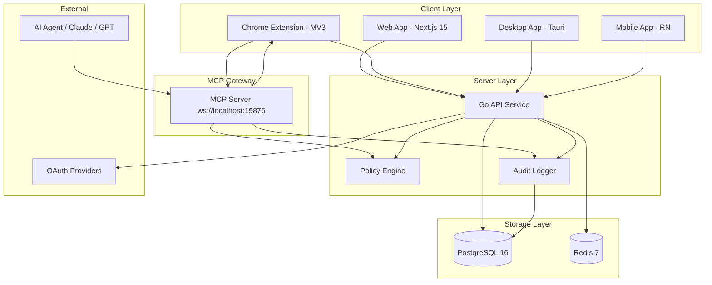
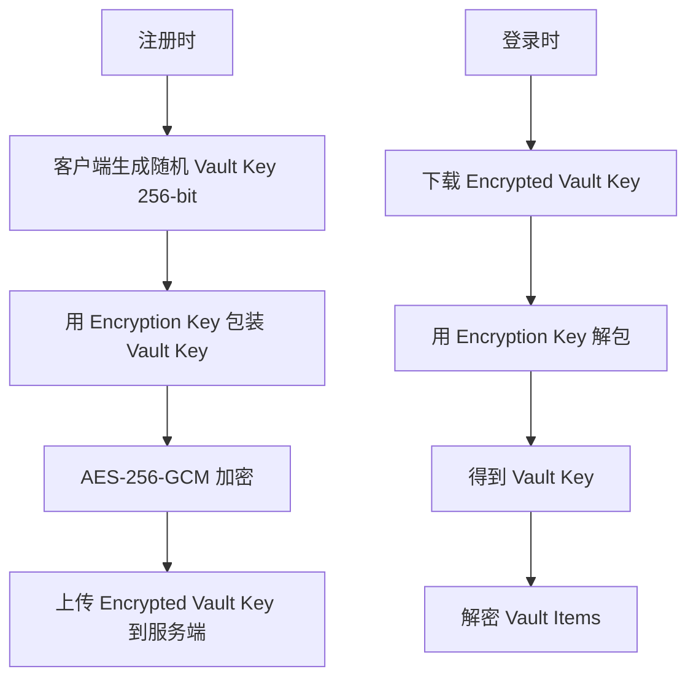
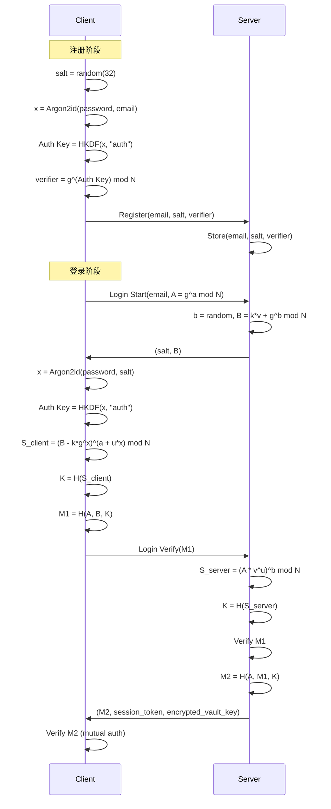
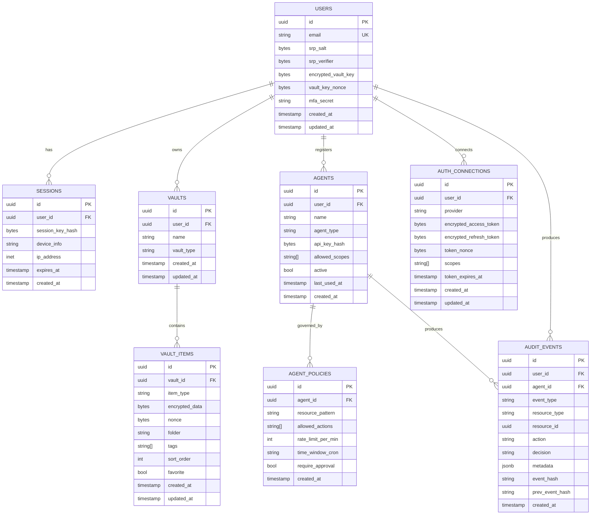
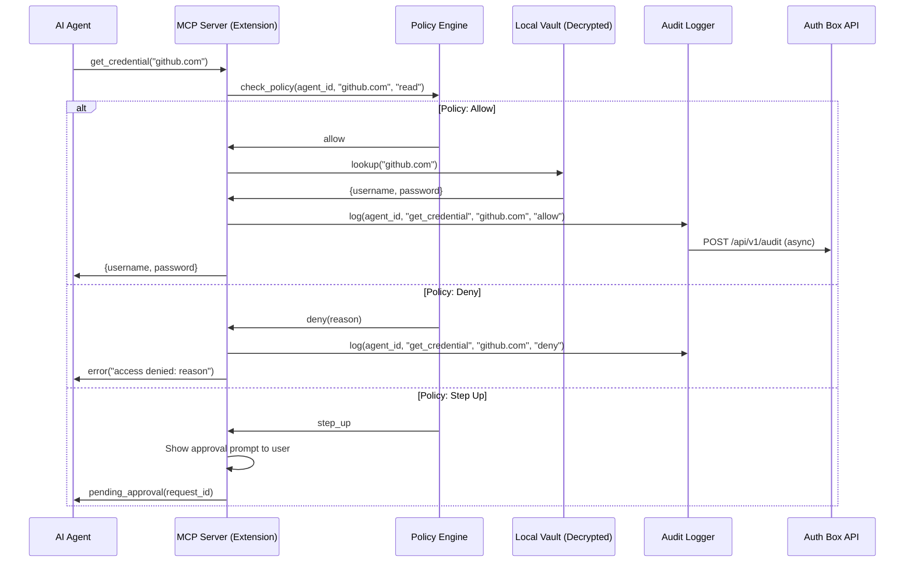

<!-- AI-TOOLS:PROJECT_DIR:BEGIN -->
- **PROJECT_DIR**: `/Users/mauricewen/Projects/10-auth-box`
- **VERIFIED_AT_UTC**: `2026-02-24T00:00:00Z`
- **RULE**: Always run tasks against the project root. If the CLI detects a mismatch, it will update this block.
<!-- AI-TOOLS:PROJECT_DIR:END -->

# 系统架构 - Auth Box v2

## 概览

Auth Box v2 采用零知识架构：**客户端持有解密后的 Vault，服务端仅存储加密后的 Blob**。Master Password 永不离开客户端，服务端无法解密任何凭据。

核心原则：
- 加密/解密全部在客户端完成
- 服务端仅做加密数据的 CRUD 与访问控制
- AI Agent 通过 MCP 网关获取凭据，受策略引擎管控

## 高层架构



## 加密设计

### 密钥派生流程

```
Master Password
       |
       v
  Argon2id(password, email_as_salt, m=64MB, t=3, p=4)
       |
       v
  Master Key (32 bytes)
       |
       +---> HKDF("auth")   ---> Auth Key     (用于 SRP-6a 认证)
       |
       +---> HKDF("enc")    ---> Encryption Key (用于包装 Vault Key)
       |
       +---> HKDF("mac")    ---> MAC Key       (用于完整性验证)
```

### Vault Key 管理



### 加密层级

| 层级 | 密钥 | 算法 | 用途 |
|------|------|------|------|
| L0 | Master Password | 用户记忆 | 唯一入口 |
| L1 | Master Key | Argon2id | 派生中间密钥 |
| L2 | Auth Key | HKDF | SRP-6a 注册与登录 |
| L2 | Encryption Key | HKDF | 包装/解包 Vault Key |
| L2 | MAC Key | HKDF | 数据完整性 |
| L3 | Vault Key | Random 256-bit | 加解密所有 Vault Items |

## SRP-6a 认证流程



## 数据库 Schema



## API 路由

### Auth (SRP)

| Method | Path | 说明 |
|--------|------|------|
| POST | `/api/v1/auth/register` | SRP 注册（email, salt, verifier, encrypted_vault_key） |
| POST | `/api/v1/auth/login/start` | SRP 登录第一步（email, A） |
| POST | `/api/v1/auth/login/verify` | SRP 登录第二步（M1） |
| POST | `/api/v1/auth/logout` | 注销当前会话 |
| POST | `/api/v1/auth/sessions` | 列出活跃会话 |
| DELETE | `/api/v1/auth/sessions/:id` | 撤销指定会话 |

### Vault

| Method | Path | 说明 |
|--------|------|------|
| GET | `/api/v1/vaults` | 列出用户的 Vault |
| POST | `/api/v1/vaults` | 创建 Vault |
| GET | `/api/v1/vaults/:id` | 获取 Vault 详情 |
| PUT | `/api/v1/vaults/:id` | 更新 Vault |
| DELETE | `/api/v1/vaults/:id` | 删除 Vault |

### Vault Items

| Method | Path | 说明 |
|--------|------|------|
| GET | `/api/v1/vaults/:vid/items` | 列出 Vault 中的条目（返回加密数据） |
| POST | `/api/v1/vaults/:vid/items` | 创建条目（客户端加密后上传） |
| GET | `/api/v1/vaults/:vid/items/:id` | 获取单个条目 |
| PUT | `/api/v1/vaults/:vid/items/:id` | 更新条目 |
| DELETE | `/api/v1/vaults/:vid/items/:id` | 删除条目 |

### Agents

| Method | Path | 说明 |
|--------|------|------|
| GET | `/api/v1/agents` | 列出已注册的 Agent |
| POST | `/api/v1/agents` | 注册新 Agent |
| GET | `/api/v1/agents/:id` | 获取 Agent 详情 |
| PUT | `/api/v1/agents/:id` | 更新 Agent 配置 |
| DELETE | `/api/v1/agents/:id` | 注销 Agent |
| POST | `/api/v1/agents/:id/policies` | 添加访问策略 |
| GET | `/api/v1/agents/:id/policies` | 列出 Agent 的策略 |

### Gateway (Agent MCP Proxy)

| Method | Path | 说明 |
|--------|------|------|
| POST | `/api/v1/gateway/request` | Agent 通过 API 请求凭据（HTTP fallback） |
| GET | `/api/v1/gateway/services` | 列出 Agent 可访问的服务 |

### Audit

| Method | Path | 说明 |
|--------|------|------|
| GET | `/api/v1/audit` | 查询审计日志 |
| GET | `/api/v1/audit/export` | 导出审计报告 |

### Import

| Method | Path | 说明 |
|--------|------|------|
| POST | `/api/v1/import/1password` | 导入 1Password 导出文件 |
| POST | `/api/v1/import/chrome` | 导入 Chrome 密码导出 |
| POST | `/api/v1/import/bitwarden` | 导入 Bitwarden 导出文件 |

### Health

| Method | Path | 说明 |
|--------|------|------|
| GET | `/health` | 健康检查 |
| GET | `/ready` | 就绪检查（含 DB/Redis 探测） |

## MCP Gateway

### 连接方式

```
AI Agent  <--WebSocket-->  Chrome Extension (MCP Server)
                               ws://localhost:19876/mcp
                               JSON-RPC 2.0
```

### MCP Tools

| Tool | 说明 | 策略管控 |
|------|------|----------|
| `get_credential` | 获取指定服务的凭据 | scope + rate_limit + time_window |
| `proxy_authenticated_request` | 代理发起已认证的 HTTP 请求 | scope + approval |
| `list_available_services` | 列出 Agent 可访问的服务列表 | read-only, rate_limit |

### MCP 网关流程



## Monorepo 结构

```
10-auth-box/
  turbo.json                    # Turborepo 配置
  pnpm-workspace.yaml           # pnpm workspace 定义
  package.json                  # Root package (scripts, devDeps)
  docker-compose.yml            # 本地开发环境
  Makefile                      # 常用命令入口

  packages/
    crypto/                     # @authbox/crypto
      src/
        argon2.ts               # Argon2id 密钥派生
        hkdf.ts                 # HKDF 密钥扩展
        aes-gcm.ts              # AES-256-GCM 加解密
        srp.ts                  # SRP-6a 客户端
        vault-crypto.ts         # Vault 加解密高层 API
        password-generator.ts   # 密码生成器
      package.json
      tsconfig.json

    shared/                     # @authbox/shared
      src/
        types/                  # 共享类型定义
        constants/              # 常量（加密参数、错误码）
        utils/                  # 工具函数
      package.json
      tsconfig.json

    mcp-protocol/               # @authbox/mcp-protocol
      src/
        types.ts                # MCP 消息类型
        server.ts               # MCP Server 实现
        tools.ts                # Tool 注册与路由
      package.json
      tsconfig.json

  apps/
    web/                        # Next.js 15 Web App
      app/
        (auth)/                 # 认证相关页面
          register/
          login/
          unlock/
        (dashboard)/            # 登录后主界面
          vault/
          agents/
          connections/
          audit/
          settings/
        api/                    # Next.js API Routes (BFF)
      package.json

    extension/                  # Chrome MV3 Extension
      manifest.json
      src/
        background/             # Service Worker
        popup/                  # Extension Popup
        content/                # Content Scripts (autofill)
        mcp/                    # MCP Server (WebSocket)
      package.json

  services/
    api/                        # Go API Service
      cmd/server/main.go
      internal/
        auth/                   # SRP 认证
        vault/                  # Vault CRUD
        agent/                  # Agent 管理
        gateway/                # MCP Gateway HTTP fallback
        audit/                  # 审计日志
        policy/                 # 策略引擎
        middleware/              # AuthN/AuthZ 中间件
      migrations/               # 数据库迁移
      go.mod
      go.sum

  doc/                          # 项目文档
  CLAUDE.md
  AGENTS.md
```

## 系统边界

- **In-scope**: 密码管理、OAuth 连接管理、AI Agent 凭据网关、审计日志
- **Out-of-scope**: 企业级 IAM、通用 API 网关、联邦身份

## 技术栈

| 组件 | 技术 |
|------|------|
| Monorepo | Turborepo + pnpm |
| 后端 | Go 1.22+ (REST + OpenAPI 3.1) |
| 前端 | Next.js 15 + React 19 |
| 浏览器扩展 | Chrome MV3 (TypeScript) |
| 加密 | WebCrypto API + @authbox/crypto |
| 数据库 | PostgreSQL 16 |
| 缓存 | Redis 7 |
| MCP | WebSocket + JSON-RPC 2.0 |

## 部署

- **本地开发**: Docker Compose (API + Web + PostgreSQL + Redis)
- **生产**: 容器化部署，API 与 Web 分层隔离

## 本地入口

| 服务 | URL |
|------|-----|
| Web App | `http://localhost:3010` |
| API Health | `http://localhost:4010/health` |
| API Base | `http://localhost:4010/api/v1` |
| MCP Gateway | `ws://localhost:19876/mcp` |

## 实现状态

| 阶段 | 内容 | 状态 |
|------|------|------|
| Phase 0 | Monorepo + Crypto + API 骨架 | DONE |
| Phase 1 | Vault CRUD + Generator + Search + Audit | DONE |
| Phase 2 | Agent CRUD + OAuth + Import | DONE |
| Phase 3 | MCP Gateway + Extension | DONE |
| Phase 4 | 2FA + Sessions + Rate Limiting | DONE |
| UX Round 1 | 12/12 UI/UX fixes | DONE |
| UX Round 2 | 7/7 Journey simulation PASS | DONE |

---

Maurice | maurice_wen@proton.me
