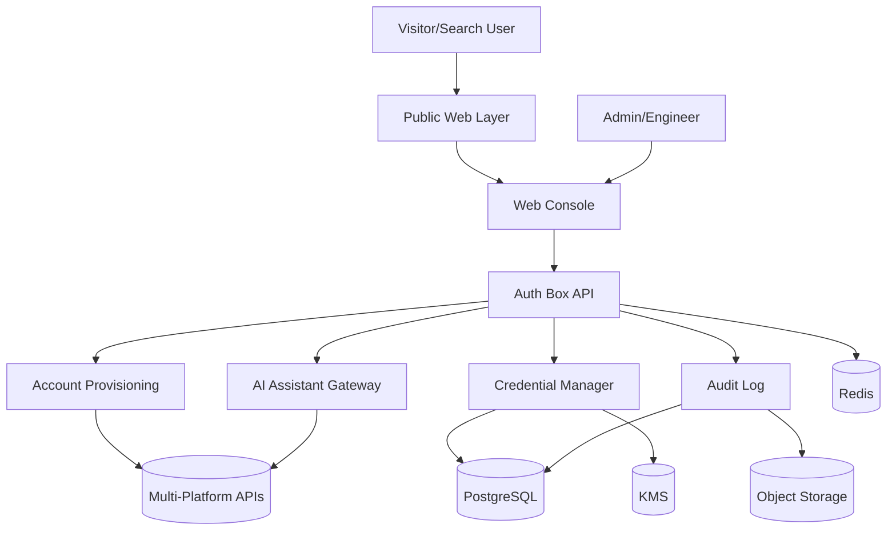
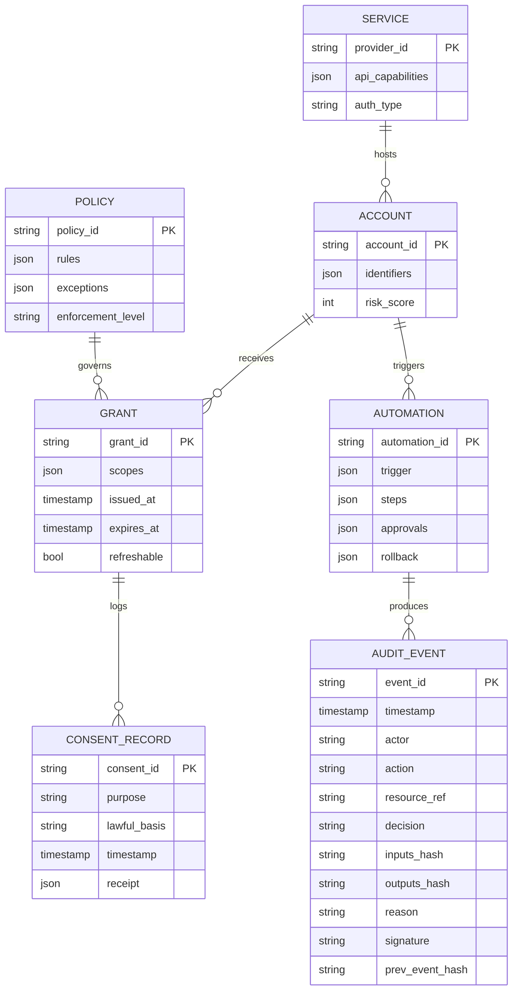
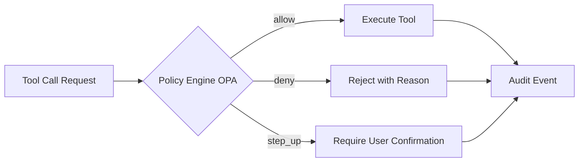

<!-- AI-TOOLS:PROJECT_DIR:BEGIN -->
- **PROJECT_DIR**: `/Users/mauricewen/Projects/10-auth-box`
- -02-13T02:24:38Z`
- **RULE**: Always run tasks against the project root. If the CLI detects a mismatch, it will update this block.
<!-- AI-TOOLS:PROJECT_DIR:END -->

# 系统架构 - Auth Box

## 概览
平台提供统一的账号创建、授权管理与 AI 助手接入治理能力，包含控制台、API 服务、密钥与审计系统。

## 高层架构（Mermaid）



## 代码结构（当前骨架）
```
apps/console        # Next.js console
services/api        # Go API service
doc/                # project docs
docker-compose.yml  # local runtime
```

## 关键模块
- Public Web Layer: 承载 SEO 入口、产品说明、对比页与文档导流。
- Web Console: 管理平台连接、账号与权限。
- Auth Box API: 核心业务 API，统一对外接口。
- Account Provisioning: 多平台账号自动创建与登记。
- Credential Manager: 授权凭据生成、轮换、吊销。
- AI Assistant Gateway: AI 助手接入与访问控制。
- Policy Engine: 策略引擎（OPA），裁决工具调用与动作权限。
- Audit Log: 操作与调用记录（Event Sourcing with hash chain）。

## 核心数据模型（来自调研 ai_master_control_prd.html）



## 接管程度刻度

系统支持 4 级接管程度，用户可在 `/settings` 配置：
- **手动**：AI 只做分析与建议，不执行动作
- **辅助（MVP 默认）**：AI 生成方案，用户确认后批量执行
- **自动**：低风险动作自动执行；高风险仍需确认
- **托管**：接近"代管"，需更强身份验证

## 策略引擎（OPA）



## 数据流
1. 管理员配置平台连接与策略。
2. 接入者请求创建账号或授权。
3. 系统创建账号并写入凭据，返回授权信息。
4. AI 助手通过网关使用授权并记录审计日志。

## 系统边界
- In-scope: 账号创建、授权管理、AI 接入、审计日志。
- Out-of-scope: 外部平台权限系统的深度替换。

## 技术栈
- 后端：Go（REST + OpenAPI 3.1）
- 前端：Next.js（控制台）
- 数据库：PostgreSQL（核心主存储）
- 缓存/队列：Redis
- 审计归档：对象存储（S3 兼容）
- 可观测性：OpenTelemetry

## 数据与安全
- 统一 AuthN/AuthZ：`/api/v1/*` 入口 middleware 强制 Bearer Token + RBAC。
- Token Registry：`AUTH_BOX_AUTH_TOKENS`（`token:actor_id:role1|role2`）。
- Token role 白名单：仅允许 `platform_admin/security_ops/compliance_auditor/policy_admin`；未知 role 启动期 fail-fast。
- 调用来源透传：支持 `X-Auth-Source`，并写入审计字段 `audit.source`。
- 高风险动作门禁：
  - `CREDENTIAL_ROTATE` / `CREDENTIAL_REVOKE` -> `security_ops`
  - `ASSISTANT_BIND` -> `security_ops`
  - `AUDIT_EXPORT_CREATE` -> `compliance_auditor`
- 凭据与敏感字段：信封加密存储（主密钥来自 KMS）
- 审计日志：append-only + hash-chain（`event_hash` / `prev_event_hash`）+ 导出归档
- 密钥轮换：按策略自动轮换与吊销

## 部署与运行
- 本地：Docker Compose 最小链路
- 生产：容器化部署，分层隔离 API/Worker/Console

## 本地入口（当前 compose）
- Console：`http://localhost:3010`
- API Health：`http://localhost:4010/health`
- API Base：`http://localhost:4010/api/v1`

## 入口与路由
- Public 入口（已实现，2026-02-11）：
  - `/`, `/product`, `/features/*`, `/use-cases/*`, `/compare/*`, `/docs`, `/blog`, `/changelog`, `/pricing`, `/security`, `/contact`
  - `/sitemap.xml`, `/robots.txt`
  - 实现文件：`apps/console/lib/marketing.ts`、`apps/console/components/marketing-page.tsx`、`apps/console/app/{product,features,use-cases,compare,pricing,security,docs,blog,changelog,contact}/`
  - 构建验证：`outputs/multi-role-brainstorm/20260211T160722Z/logs/console_build_public_routes.log`
- Web 控制台入口：`/`
- 平台连接：`/platforms`, `/platforms/new`, `/platforms/:id`
- 账号：`/accounts`, `/accounts/new`, `/accounts/:id`
- 授权凭据：`/credentials`, `/credentials/:id`, `/credentials/:id/rotate`
- AI 助手：`/assistants`, `/assistants/new`, `/assistants/:id`
- 审计日志：`/audit`, `/audit/exports`
- 漏斗看板：`/metrics/funnel`
- 设置：`/settings`

## Sitemap 与关键词路由策略（已实现）
- 规范文档：`doc/00_project/initiative_10_auth_box/SITEMAP_KEYWORD_STRATEGY.md`
- URL 分层：
  - 核心能力：`/features/platform-account-provisioning`, `/features/credential-lifecycle`, `/features/ai-assistant-governance`, `/features/audit-hash-chain`
  - 场景落地：`/use-cases/security-ops`, `/use-cases/compliance-audit`, `/use-cases/platform-admin`
  - 对比页：`/compare/hashicorp-vault-alternative`, `/compare/doppler-alternative`, `/compare/kong-konnect-alternative`
- 元数据端点：`/sitemap.xml`（`apps/console/app/sitemap.ts`）、`/robots.txt`（`apps/console/app/robots.ts`）

## API 面（当前能力）
- Base：`/api/v1`
- Health：`/health`（200）
- 平台连接：`/api/v1/platforms`（已实现）
- 账号：`/api/v1/accounts`（已实现）
- 授权凭据：`/api/v1/credentials`（已实现：create/list/rotate/delete）
- AI 助手：`/api/v1/assistants`（已实现：create/list/get/bind）
- 审计：`/api/v1/audit`（已实现：list/export/create export/get export）
- Console telemetry：
  - `POST /api/telemetry/public-events`（Public 事件采集）
  - `GET /api/telemetry/public-funnel`（SEO 漏斗 + 产品漏斗聚合视图）
    - 支持查询参数：`window_minutes` / `bucket_minutes` / `recent_limit` / `source` / `persona` / `route` / `tenant_id`
    - 返回增强：`top_tenants` / `alerts`
    - 阈值配置：`AUTH_BOX_FUNNEL_MIN_CTA_CTR_PERCENT` / `AUTH_BOX_FUNNEL_MIN_COMPLETION_PERCENT` / `AUTH_BOX_FUNNEL_MIN_SEO_VIEWS_FOR_EVALUATION` / `AUTH_BOX_FUNNEL_MIN_ONBOARDING_FOR_EVALUATION`
  - 持久化文件：`AUTH_BOX_CONSOLE_TELEMETRY_FILE`（默认 `outputs/telemetry/public-events.ndjson`）
  - 重启持久化证据：`outputs/multi-role-brainstorm/20260211T160722Z/reports/persistence/funnel_before_restart.json`、`outputs/multi-role-brainstorm/20260211T160722Z/reports/persistence/funnel_after_restart.json`
  - 过滤与趋势证据：`outputs/multi-role-brainstorm/20260211T160722Z/reports/filter_trend/funnel_beta_30m.json`、`outputs/multi-role-brainstorm/20260211T160722Z/reports/filter_trend/filter_trend_assertion.txt`
  - 分租户告警证据：`outputs/multi-role-brainstorm/20260211T160722Z/reports/tenant_alert/funnel_beta_180m.json`、`outputs/multi-role-brainstorm/20260211T160722Z/reports/tenant_alert/tenant_alert_assertion.txt`

## 架构圆桌结论（Council，2026-02-11）
- Run：`outputs/architecture-council-adr/20260211T145910Z`
- 角色：Architect / Security Lead / SRE Lead
- 输出：
  - ADR：`doc/00_project/initiative_10_auth_box/ARCHITECTURE_ADR.md`
  - 风险清单：`doc/00_project/initiative_10_auth_box/ARCHITECTURE_RISK_REGISTER.md`

### ADR 决议（Accepted）
- ADR-001：MVP 阶段维持分层模块化单体，按 Platform/Account/Credential/Assistant/Audit 固化边界。
- ADR-002：将安全基线前移到入口 middleware，统一认证鉴权与策略校验。
- ADR-003：以 SLO 驱动可靠性与可观测性建设，分 MVP-1/MVP-2 逐步达成。

### 风险优先项（Top）
| ID | 风险 | 当前状态 |
|---|---|---|
| ARC-SEC-01 | API 入口缺少统一 AuthN/AuthZ 守门 | Closed |
| ARC-SEC-02 | 审计链路不可抵赖性不足 | Closed |
| ARC-SRE-01 | 缺少 readiness 与依赖健康探测 | Open |
| ARC-SRE-02 | 缺少 SLO/告警阈值治理 | Open |
| ARC-ARCH-02 | 文档与实现可能再次漂移 | Open |

完整风险与处置计划见：`doc/00_project/initiative_10_auth_box/ARCHITECTURE_RISK_REGISTER.md`。

### SLO 与可观测性基线
- MVP-1：Availability >= 99.5%，API p95 < 300ms，5xx < 1%。
- MVP-2：Availability >= 99.9%，API p95 < 250ms，5xx < 0.5%。
- 核心监控维度：request_count、request_latency、error_rate、saturation、queue_depth。
- 告警阈值：
  - p95 > 300ms 持续 10 分钟
  - 5xx > 1% 持续 5 分钟
  - audit export failure > 2% 持续 10 分钟

## 一键全量交付验收架构检查（2026-02-12，已完成）
- SOP 证据目录：`outputs/one-click-full-delivery/20260212T022828Z`
- 本轮检查入口：
  - Frontend：`/`, `/product`, `/compare/*`, `/platforms/new`, `/metrics/funnel`
  - Backend：`/api/v1/*`, `/api/telemetry/public-events`, `/api/telemetry/public-funnel`
- 检查维度：
  - 入口一致性（路由/API/配置）
  - API 契约与错误码一致性
  - 可观测指标链路与告警口径一致性
- 检查结果：
  - `outputs/one-click-full-delivery/20260212T022828Z/reports/full_loop/reports/full_loop_summary.json` = `overall_pass=true`
  - `outputs/one-click-full-delivery/20260212T022828Z/reports/backend_contract_entry_assertion.txt` = PASS

## 回归夹具（Fixtures）与回放
- 真实 API fixture 清单：`services/api/testdata/fixtures/real_api_core_flow/manifest.json`
- 回归脚本：
  - 采样：`services/api/scripts/real_api_core_flow.sh --mode capture --project-dir .`
  - 回放：`services/api/scripts/replay_real_api_fixtures.sh --project-dir .`
- 闭环总检：`scripts/full_loop_closure_check.sh`
- 验收要求：最终验收使用真实 API，禁止 mock。

## SOP 4.1 回归记录（2026-02-12）
- Run：`outputs/project-regression/20260212T030804Z`
- 架构闭环验证：
  - 入口闭环（UI 路由/CLI/配置）PASS：
    - `outputs/project-regression/20260212T030804Z/reports/full_loop_closure/reports/entrypoint_report.json`
  - 系统闭环（frontend -> backend -> persistence -> echo）PASS：
    - `outputs/project-regression/20260212T030804Z/reports/full_loop_closure/reports/system_loop_report.json`
  - 契约闭环（错误码/权限模型/契约测试）PASS：
    - `outputs/project-regression/20260212T030804Z/reports/full_loop_closure/logs/full_loop_steps.log`
- 结论：本轮未发生系统边界或分层调整。

## 一键全量交付复核（2026-02-12，Run 20260212T032220Z）
- 复核入口：`/`、`/product`、`/compare/*`、`/platforms/new`、`/metrics/funnel` 与 `/api/v1/*`。
- 复核目标：验证入口一致性、契约一致性、系统闭环（frontend -> backend -> persistence -> echo）与可观测证据链。
- 当前状态：Step 4（UX Map Round 2）已通过，证据见 `outputs/one-click-full-delivery/20260212T032220Z/reports/uxmap_round2/uxmap_round2_assertion.txt`。
- 最终状态：Step 6/7 已通过，`full_loop_summary.json` 为 `overall_pass=true`，backend assertion 全 PASS。
- 架构结论：本轮未引入新的系统边界或分层变化。

## SOP 4.1 回归记录（2026-02-12，Run 20260212T034924Z）
- Run：`outputs/project-regression/20260212T034924Z`
- 架构闭环验证：
  - 入口闭环 PASS：`outputs/project-regression/20260212T034924Z/reports/full_loop_closure/reports/entrypoint_report.json`
  - 系统闭环 PASS：`outputs/project-regression/20260212T034924Z/reports/full_loop_closure/reports/system_loop_report.json`
  - 契约与验证闭环 PASS：`outputs/project-regression/20260212T034924Z/reports/full_loop_closure/reports/full_loop_summary.json`
- 追踪修复：Step 3 telemetry 事件请求字段统一为 `event`，与 `public-events` API 契约保持一致。
- 结论：本轮未发生系统边界、分层与接口面扩展变化。
