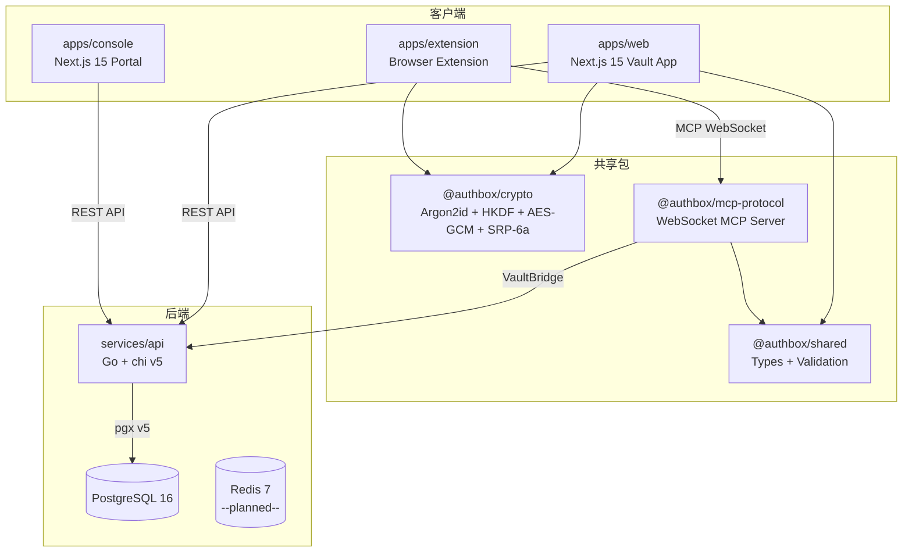
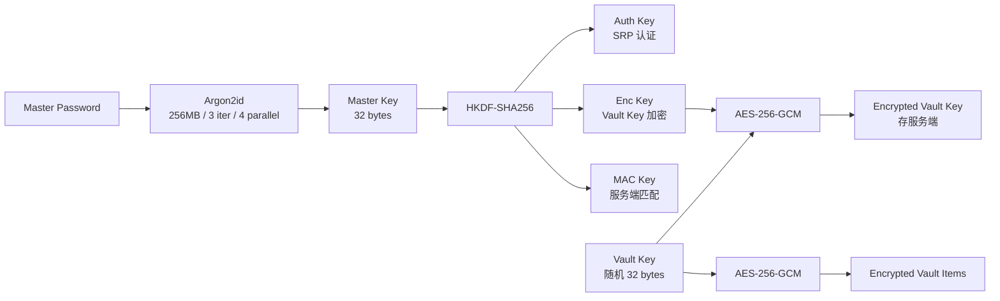
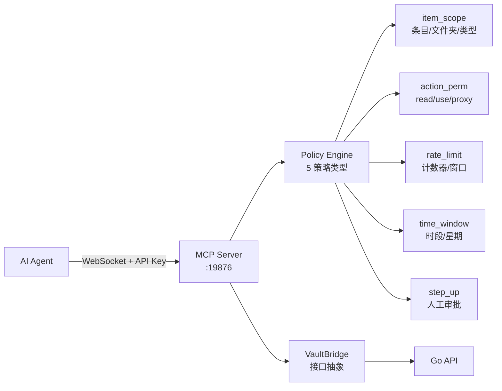
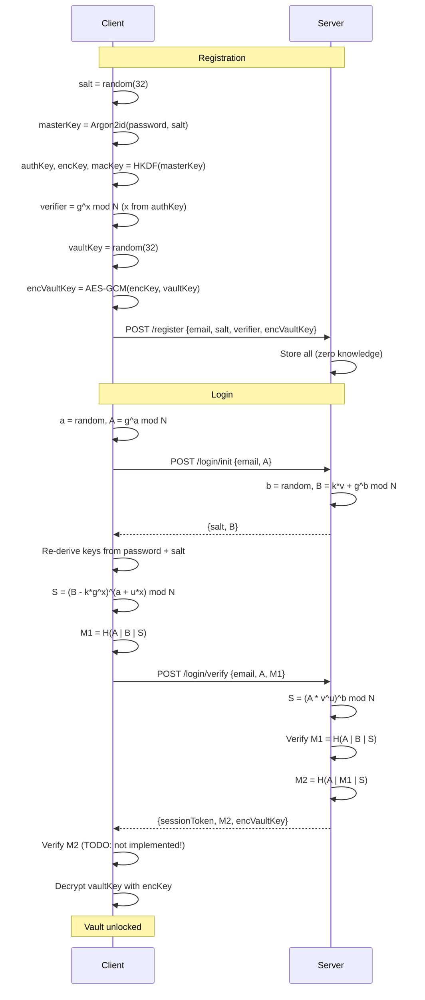
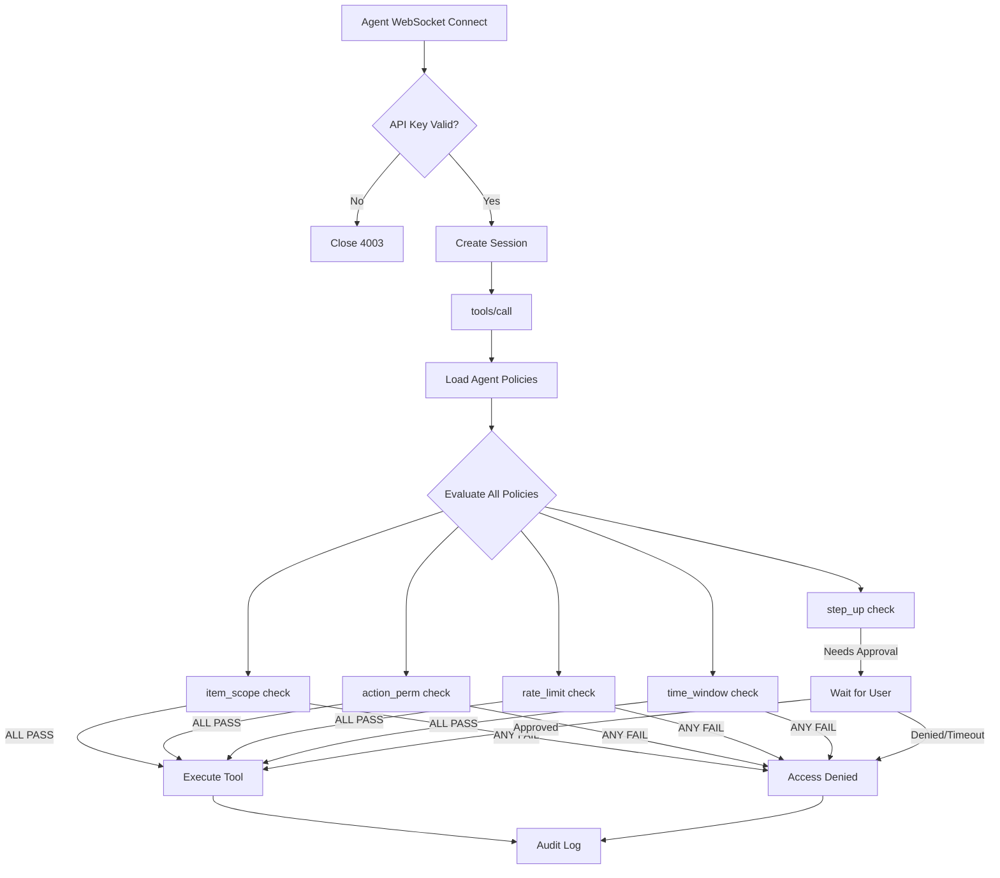

# Auth Box v2 -- 全栈架构审计报告

> 审计日期: 2026-03-20
> 审计范围: Backend (Go) / Frontend (Next.js) / Crypto / MCP Protocol / DB Schema / Security / Infra
> 代码库: `/Users/mauricewen/Projects/10-auth-box`

---

## 一、架构总览评分

| 维度 | 评分 (1-10) | 说明 |
|------|:-----------:|------|
| **后端架构** | 8 | DDD 分层清晰，chi v5 + pgx v5 选型正确，缺接口抽象和测试 |
| **前端架构** | 7 | Next.js 15 App Router + Zustand 状态管理合理，但 web/console 存在重复 |
| **加密架构** | 9 | Argon2id -> HKDF -> AES-256-GCM 密钥链完整，SRP-6a 实现规范 |
| **MCP 协议** | 8 | Policy Engine 5 种策略完备，step-up 审批流程设计精巧 |
| **数据库设计** | 7 | 7 个迁移覆盖核心表，索引合理，缺少软删除和版本控制 |
| **安全性** | 8 | 零知识架构、安全头、速率限制、审计链完整，缺 CSRF token 和 TOTP 登录集成 |
| **基础设施** | 6 | docker-compose 可用，缺生产 CI/CD、TLS 配置、Redis 集成 |
| **综合** | **7.5** | 架构设计水平高于同阶段产品，关键短板在测试覆盖和生产部署就绪度 |

---

## 二、架构总览



---

## 三、各层详细评估

### 3.1 后端架构 (Go API)

**分层结构:**

```
services/api/internal/
  domain/       -- 6 个领域模型 (User, Session, VaultItem, Agent, Connection, AuditEvent)
  service/      -- 6 个业务服务
  handler/      -- 7 个 HTTP 处理器
  repository/pg -- 6 个数据仓库
  auth/         -- SRP + Session + Middleware
  middleware/   -- Security + RateLimit
  config/       -- 环境变量配置
```

**优点:**

1. **DDD 分层一致**: domain -> service -> handler -> repository 单向依赖，无循环引用
2. **路由设计规范**: 34 个 API 端点按功能分组 (auth/vault/agents/connections/audit)，RESTful 语义清晰
3. **连接池配置合理**: pgxpool MaxConns=20, MinConns=2, HealthCheck=30s
4. **HTTP Server 安全**: 完整超时套件 (ReadHeader=5s, Read=10s, Write=30s, Idle=120s)，防 Slowloris
5. **迁移管理成熟**: golang-migrate + pgx5 驱动，支持 up/down/migrate-only

**问题:**

| 严重度 | 问题 | 位置 |
|--------|------|------|
| P0 | **Service 层直接依赖具体仓库类型** (`*pg.UserRepository` 而非接口)，无法 mock 测试 | `service/*.go` |
| P0 | **零测试覆盖**: 没有任何 `_test.go` 文件 | `services/api/` |
| P1 | **SRP pending login 存内存**: 多实例部署会导致 init/verify 分到不同实例失败 | `auth_service.go:64` |
| P1 | **速率限制纯内存**: 多实例部署时每个实例独立计数，无法全局限流 | `ratelimit.go` |
| P1 | **错误类型不够丰富**: 大量 `errors.New()` 裸字符串，缺少结构化错误类型 | 全局 |
| P2 | **Audit chain verification 时间格式不一致**: CreateEvent 用 Go 格式化，VerifyChain 用 `fmt.Sprintf("%v", createdAt)` 导致 hash 可能不匹配 | `audit_repo.go:123` |
| P2 | **SyncPush 不在事务中**: 批量创建逐个执行，中间失败导致部分写入 | `vault_service.go:206-214` |
| P2 | **LoginVerify 缺少 clientPublicA 传递**: LoginInit 解码了 clientA 但未存储，LoginVerify 中 clientA 需要重新从请求获取 | `auth_service.go:153` |

### 3.2 前端架构

**apps/web (Vault App):**

- 9 个路由，按 `(auth)` 和 `(vault)` 两个路由组划分
- Zustand 状态管理 (`vault-store.ts`) 管理 session + vault 状态
- 加密 vault key 仅存内存 (`vaultKey: Uint8Array | null`)，关闭标签页即清除
- 组件目录: `components/ui/` (3 基础组件) + `components/vault/` (5 业务组件)

**apps/console (Portal):**

- 20+ 页面覆盖营销 + 管理后台
- 遥测系统 (`public-telemetry-client.ts`, `public-telemetry-store.ts`)
- 营销页面组件复用 (`marketing-page.tsx`, `page-shell.tsx`)

**apps/extension (Browser Extension):**

- Vite 构建，`background/` + `popup/` + `content/` 三层标准结构
- `vault-cache.ts` 管理扩展内缓存
- `messages.ts` 管理跨上下文通信

**优点:**

1. API 层类型安全 (`api.ts` 为每个端点定义了完整的 request/response 类型)
2. 加密操作在客户端完成，服务器永远接触不到明文
3. Vault store 设计安全：lock 时清除密钥和条目

**问题:**

| 严重度 | 问题 | 位置 |
|--------|------|------|
| P1 | **loginVerify 未传递 clientPublicA**: `authApi.loginVerify` 只发送 email + clientProofM1，但后端 `loginVerifyRequest` 需要 clientPublicA | `auth.ts:122`, `api.ts:78-95` |
| P1 | **ServerProofM2 未校验**: 客户端收到 M2 但未验证（SRP 协议要求客户端验证 M2 以确认服务器身份） | `auth.ts:122-138` |
| P1 | **大数组 btoa 会 stack overflow**: `toBase64` 用展开运算符 `String.fromCharCode(...bytes)` 处理 256 字节 SRP 公钥可能触发浏览器栈溢出 | `auth.ts:42` |
| P2 | **API 和 VaultStore 类型不同步**: VaultStore 的 `DecryptedVaultItem` 有 `vaultId/favorite/folderId` 字段但 API 未返回 | `vault-store.ts` vs `api.ts` |
| P2 | **web 和 console 的 api.ts 重复**: 两个 app 各有独立的 API 客户端 | `apps/web/lib/api.ts`, `apps/console/lib/api.ts` |
| P2 | **无离线 / Service Worker 支持**: 密码管理器应考虑离线可用性 | 全局 |

### 3.3 加密架构

**密钥派生链:**



**优点:**

1. **正确的密钥分离**: HKDF 派生 auth/enc/mac 三个独立子密钥，域分离到位
2. **WebCrypto API**: AES-256-GCM 使用浏览器原生实现，非 JS polyfill
3. **SRP-6a 实现完整**: 客户端和服务端使用相同的 RFC 5054 2048-bit 群参数
4. **安全检查到位**: A mod N != 0, B mod N != 0, u != 0 等 SRP 安全约束全部实现
5. **常量时间比较**: 服务端 `constantTimeEqual` 防止时序攻击

**问题:**

| 严重度 | 问题 | 位置 |
|--------|------|------|
| P1 | **SRP M1/M2 简化公式**: 使用 M1=H(A\|B\|S) 而非完整的 RFC 2945 公式 M1=H(H(N)^H(g) \| H(I) \| s \| A \| B \| K)。安全性影响较小但偏离标准 | `srp.go:82`, `srp.ts:207` |
| P1 | **客户端 M1 用 sessionKey 而非 S**: 客户端计算 M1 = H(A\|B\|K) 其中 K=H(S)，但服务端期望 M1 = H(A\|B\|S)，**这会导致 SRP 验证永远失败** | `srp.ts:207` vs `srp.go:111` |
| P2 | **HKDF salt/info 语义反转**: `deriveSubKey` 将 purpose 字符串作为 salt（应为 info），salt 应使用随机值或空 | `hkdf.ts:19-21` |
| P2 | **MAC Key 生成但未使用**: `deriveKeys` 输出 macKey 但代码中无引用 | `argon2.ts:8` |
| P2 | **modPow 非恒定时间**: TypeScript BigInt 的 modPow 实现不保证恒定时间，可能有侧信道泄露风险 | `srp.ts:56-67` |

### 3.4 MCP 协议

**架构:**



**优点:**

1. **3 个 MCP Tool 定义精确**: get_credential / proxy_authenticated_request / list_available_services
2. **Proxy 模式优秀**: Agent 通过 proxy_authenticated_request 发请求，凭证在服务端注入，Agent 永远不接触明文
3. **5 种策略引擎**: item_scope / action_perm / rate_limit / time_window / step_up 覆盖全面
4. **Step-up 审批**: Promise-based 异步审批 + 超时自动拒绝，与浏览器扩展联动
5. **VaultBridge 接口抽象**: MCP Server 与后端解耦，可替换实现

**问题:**

| 严重度 | 问题 | 位置 |
|--------|------|------|
| P1 | **API Key 通过 URL 查询参数传递**: `url.searchParams.get('api_key')` 会留在服务器日志和浏览器历史中 | `server.ts:84` |
| P1 | **WebSocket 无 TLS**: 生产环境必须使用 wss://，当前 `new WebSocketServer({ port })` 无加密 | `server.ts:80` |
| P2 | **未知 policyType 默认 allow**: `default: return { allowed: true }` 应该默认拒绝 | `policy-engine.ts:82-83` |
| P2 | **Rate limit 按 agentId 全局计数**: 不区分不同 tool/action，一个高频操作会阻塞所有操作 | `policy-engine.ts:141` |
| P2 | **审计日志失败被静默吞掉**: `catch {}` 空捕获导致审计链断裂不可知 | `server.ts:418-419` |

### 3.5 数据库设计

**7 个迁移 / 6 个核心表:**

| 表 | 字段数 | 索引数 | 说明 |
|----|:------:|:------:|------|
| users | 12 | 1 (email) | 用户主表 + KDF + SRP + TOTP |
| sessions | 8 | 3 (user_id, token_hash, expires_at) | 会话管理 |
| vault_items | 9 | 2 (user_id, version) | 加密保险箱条目 |
| agents | 10 | 3 (user_id, api_key_hash, user+name unique) | AI Agent 注册 |
| agent_policies | 9 | 1 (agent_id) | Agent 访问策略 |
| auth_connections | 17 | 2 (user_id, user+provider+account unique) | OAuth 连接 |
| audit_events | 13 | 4 (user_id, actor, created_at, action) | 审计哈希链 |

**优点:**

1. 所有表使用 UUID 主键 + `gen_random_uuid()`
2. 外键 ON DELETE CASCADE 保证级联清理
3. 加密字段 (enc + nonce + tag) 三元组完整
4. 审计表包含 event_hash/prev_event_hash 构成可验证链

**问题:**

| 严重度 | 问题 | 位置 |
|--------|------|------|
| P1 | **无软删除**: vault_items 硬删除，无法实现回收站功能 | `003_vault_items.up.sql` |
| P1 | **vault_items 缺 deleted_at + is_deleted**: 密码管理器需要「最近删除」功能 | 同上 |
| P2 | **sessions 无自动清理**: 过期 session 需要外部 cron 或 pg_cron 清理 | `002_sessions.up.sql` |
| P2 | **vault_items version 是行级**: SyncPull 按 version > X 查询只能做增量同步，缺全局版本向量 | `003_vault_items.up.sql` |
| P2 | **audit_events 无分区**: 审计数据会无限增长，缺少时间分区策略 | `006_audit_events.up.sql` |
| P2 | **users.email 无 CITEXT 或 LOWER 索引**: 大小写敏感可能导致重复注册 | `001_users.up.sql` |

### 3.6 安全性

**已实现:**

- [x] 零知识架构: 服务器永远不接触明文密码或 vault 内容
- [x] SRP-6a: 密码从不传输
- [x] AES-256-GCM: 经过认证的加密
- [x] Argon2id (256MB, 3 iter): OWASP 推荐参数
- [x] Session token 存 hash: 数据库泄露不影响 active sessions
- [x] 安全头: CSP, X-Frame-Options, HSTS, no-sniff, no-referrer
- [x] 速率限制: auth 5/min, protected 120/min
- [x] 请求体大小限制: 1MB
- [x] Content-Type 强制: 非 GET/HEAD 必须 application/json
- [x] 审计哈希链: SHA-256 链式哈希可验证完整性
- [x] CORS 来源校验: 拒绝通配符 `*`
- [x] HTTP 超时完整: 防 Slowloris
- [x] Agent API Key 存 hash: 泄露数据库不暴露 API Key
- [x] 常量时间比较: SRP proof 验证

**未实现:**

| 严重度 | 缺失项 | 说明 |
|--------|--------|------|
| P0 | **TOTP 未集成到登录流程** | enroll/verify/disable 端点存在，但 LoginVerify 未检查 TOTP 状态 |
| P1 | **无 CSRF 保护** | Cookie-less Bearer token 模式本身抗 CSRF，但 CORS 配置应更严格 |
| P1 | **session token 无 HttpOnly cookie 选项** | 纯 Bearer token 存前端 JS 变量，XSS 可窃取 |
| P1 | **无暴力破解保护**: 登录失败无账户锁定/渐进延迟 | `auth_handler.go` |
| P2 | **RedisURL 在配置中但未使用** | 速率限制和 session 存储应迁移到 Redis |
| P2 | **API 日志记录了错误信息但未脱敏** | `slog.Error("register failed", "error", err)` 可能泄露内部信息 |

### 3.7 基础设施

**已有:**

- `docker-compose.yml`: postgres + api + web，health checks 完整
- `Makefile`: 22 个 target 覆盖 setup/dev/build/test/docker/migrate/SOP
- Turborepo + pnpm workspace 管理 monorepo
- GitHub Actions: `release-gate.yml` + `agent-design-check.yml` (仅 SOP，非 CI/CD)

**问题:**

| 严重度 | 问题 | 说明 |
|--------|------|------|
| P0 | **无 CI/CD 管线**: 没有构建/测试/部署的 GitHub Actions workflow | 需要 lint + test + build + deploy |
| P1 | **Redis 被注释**: docker-compose 中 Redis 服务被注释，速率限制和 session 都是内存实现 | 单实例限制 |
| P1 | **无 TLS 配置**: API server 纯 HTTP，需要反向代理 (nginx/caddy) 或直接 TLS | 安全 |
| P1 | **Dockerfile for web 引用但不存在**: docker-compose 引用 `apps/web/Dockerfile` | 构建 |
| P2 | **Docker 内存限制过低**: API 256MB, Web 512MB -- 加密操作 (Argon2id 256MB) 可能 OOM | 资源 |
| P2 | **无监控/告警**: 缺少 Prometheus metrics endpoint 或 healthcheck 告警 | 运维 |
| P2 | **无备份策略**: PostgreSQL volume 无备份计划 | 数据安全 |

---

## 四、架构问题清单 (按严重度)

### P0 (阻断/必须修复)

1. **SRP M1 客户端/服务端不一致** -- 客户端用 H(A|B|K)，服务端期望 H(A|B|S)，登录必然失败
2. **TOTP 未集成到登录流程** -- 2FA 功能存在但不起作用
3. **零测试覆盖** -- 后端无任何 Go 测试文件
4. **Service 层硬编码仓库类型** -- 无法进行单元测试

### P1 (重要/应尽快修复)

5. **SRP pending login 存内存** -- 多实例部署不可用
6. **速率限制纯内存** -- 多实例部署无效
7. **ServerProofM2 未校验** -- 客户端未验证服务器身份
8. **API Key 通过 URL 参数传递** -- 安全风险
9. **WebSocket 无 TLS** -- 明文传输
10. **loginVerify 请求缺字段** -- 前端 API 调用缺 clientPublicA
11. **大数组 btoa 潜在 stack overflow** -- SRP 公钥 base64 编码
12. **无 CI/CD** -- 缺少自动化构建部署
13. **Redis 未启用** -- 单实例限制
14. **无暴力破解保护** -- 账户安全
15. **vault_items 无软删除** -- 产品功能缺失

### P2 (改进建议)

16. Audit chain 时间格式不一致
17. SyncPush 无事务
18. HKDF salt/info 语义反转
19. MAC Key 未使用
20. 未知 policyType 默认 allow
21. 审计日志失败被静默吞掉
22. sessions 无自动清理
23. email 无 CITEXT
24. 前端 API 客户端重复
25. 类型不同步

---

## 五、优化建议

### 短期 (1-2 周)

1. **修复 SRP M1 不一致** (P0): 统一客户端和服务端的 M1 计算公式为 H(A|B|S)，服务端已正确，客户端 `srp.ts:207` 需改为用 S 而非 sessionKey(=H(S))
2. **集成 TOTP 到登录** (P0): LoginVerify 检查 user.TOTPEnabled，若启用则要求额外的 TOTP code 验证步骤
3. **添加仓库接口** (P0): 为每个 repository 抽取 interface，service 层依赖接口
4. **添加核心测试** (P0): SRP 握手端到端测试、vault CRUD 测试、audit chain 完整性测试
5. **修复 loginVerify 前端调用** (P1): 传递 clientPublicA
6. **添加 M2 校验** (P1): 客户端验证 serverProofM2
7. **base64 改用 chunk 处理** (P1): 替换 `String.fromCharCode(...bytes)` 为分块处理

### 中期 (2-4 周)

8. **启用 Redis** (P1): session 存储 + 速率限制 + SRP pending login 迁移到 Redis
9. **CI/CD 管线** (P1): GitHub Actions -- lint -> typecheck -> test-crypto -> test-api -> build -> deploy
10. **WebSocket TLS** (P1): 通过反向代理或直接配置 wss://
11. **MCP API Key 改 header** (P1): 从 URL 参数迁移到 `Authorization: Bearer` 或自定义 header
12. **结构化错误类型** (P1): 定义 `AppError` 类型包含 code/message/status
13. **软删除** (P1): vault_items 添加 deleted_at，实现回收站
14. **暴力破解保护** (P1): 连续失败 5 次锁定 15 分钟

### 长期 (1-3 月)

15. **未知 policyType 默认拒绝** (P2)
16. **审计表分区** (P2): 按月分区，定期归档
17. **Vault 同步优化** (P2): 实现操作日志 (operation log) + CRDT/向量时钟解决冲突
18. **Prometheus metrics** (P2): 请求延迟、错误率、审计链长度
19. **离线支持** (P2): Service Worker + IndexedDB 本地加密缓存
20. **SyncPush 事务化** (P2): 包裹在 `pgx.BeginTx` 中

---

## 六、关键架构决策 Mermaid 图

### 6.1 认证流程



### 6.2 MCP Agent 访问控制



---

## 七、Decision Log Entry

```
ID:       DL-2026-0320-AUTH-BOX-AUDIT
Date:     2026-03-20
Auditor:  Claude Opus 4.6 (1M context)
Project:  Auth Box v2
Scope:    Full architecture audit (7 dimensions)

Decision: 架构基础扎实 (7.5/10)，加密设计优秀 (9/10)，
          但存在 4 个 P0 阻断问题必须在下一迭代修复:
          1. SRP M1 客户端/服务端计算不一致 (登录不可用)
          2. TOTP 2FA 未集成到登录流程
          3. 零测试覆盖
          4. Service 层无接口抽象

Options:
  A. 修复 P0 + 添加核心测试 -> 最小可验证版本 (推荐, 1-2 周)
  B. 修复 P0 + 启用 Redis + CI/CD -> 生产就绪 (3-4 周)
  C. 全面重构 Service 层 + 添加仓库接口 + 完整测试矩阵 (6-8 周)

Recommendation: Option A 先行，Option B 跟进。
                加密和 MCP 协议层质量高，无需重写。
                重点补齐测试和修复 SRP 不一致。

Risk: SRP M1 不一致意味着当前登录流程不可用，
      这是最高优先级修复项。
```

---

Maurice | maurice_wen@proton.me
