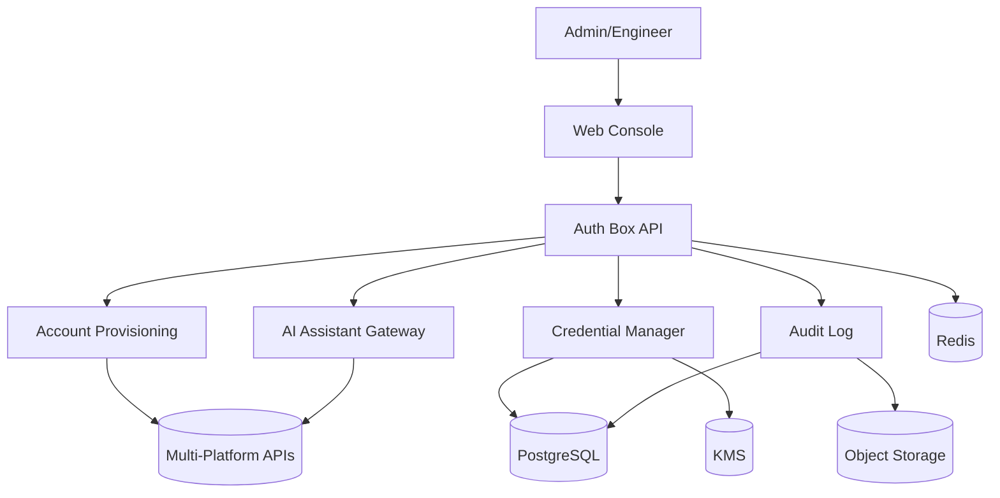
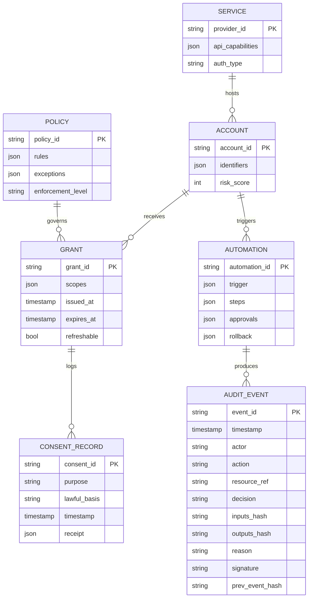
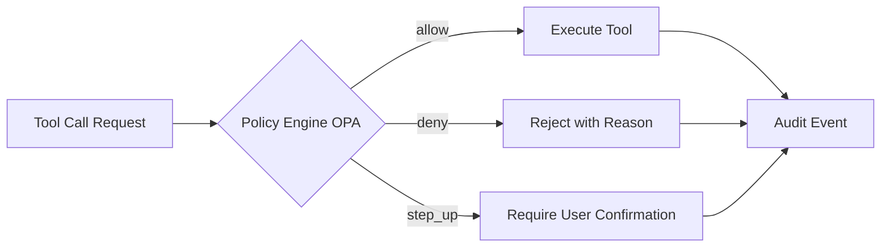

<!-- AI-TOOLS:PROJECT_DIR:BEGIN -->
- **PROJECT_DIR**: `/Users/mauricewen/Projects/10-auth-box`
- **VERIFIED_AT_UTC**: `2026-02-11T14:47:54Z`
- **RULE**: Always run tasks against the project root. If the CLI detects a mismatch, it will update this block.
<!-- AI-TOOLS:PROJECT_DIR:END -->

# 系统架构 - Auth Box

## 概览
平台提供统一的账号创建、授权管理与 AI 助手接入治理能力，包含控制台、API 服务、密钥与审计系统。

## 高层架构（Mermaid）



## 代码结构（当前骨架）
```
apps/console        # Next.js console
services/api        # Go API service
doc/                # project docs
docker-compose.yml  # local runtime
```

## 关键模块
- Web Console: 管理平台连接、账号与权限。
- Auth Box API: 核心业务 API，统一对外接口。
- Account Provisioning: 多平台账号自动创建与登记。
- Credential Manager: 授权凭据生成、轮换、吊销。
- AI Assistant Gateway: AI 助手接入与访问控制。
- Policy Engine: 策略引擎（OPA），裁决工具调用与动作权限。
- Audit Log: 操作与调用记录（Event Sourcing with hash chain）。

## 核心数据模型（来自调研 ai_master_control_prd.html）



## 接管程度刻度

系统支持 4 级接管程度，用户可在 `/settings` 配置：
- **手动**：AI 只做分析与建议，不执行动作
- **辅助（MVP 默认）**：AI 生成方案，用户确认后批量执行
- **自动**：低风险动作自动执行；高风险仍需确认
- **托管**：接近"代管"，需更强身份验证

## 策略引擎（OPA）



## 数据流
1. 管理员配置平台连接与策略。
2. 接入者请求创建账号或授权。
3. 系统创建账号并写入凭据，返回授权信息。
4. AI 助手通过网关使用授权并记录审计日志。

## 系统边界
- In-scope: 账号创建、授权管理、AI 接入、审计日志。
- Out-of-scope: 外部平台权限系统的深度替换。

## 技术栈
- 后端：Go（REST + OpenAPI 3.1）
- 前端：Next.js（控制台）
- 数据库：PostgreSQL（核心主存储）
- 缓存/队列：Redis
- 审计归档：对象存储（S3 兼容）
- 可观测性：OpenTelemetry

## 数据与安全
- 凭据与敏感字段：信封加密存储（主密钥来自 KMS）
- 审计日志：append-only + 导出归档
- 密钥轮换：按策略自动轮换与吊销

## 部署与运行
- 本地：Docker Compose 最小链路
- 生产：容器化部署，分层隔离 API/Worker/Console

## 本地入口（当前 compose）
- Console：`http://localhost:3010`
- API Health：`http://localhost:4010/health`
- API Base：`http://localhost:4010/api/v1`

## 入口与路由
- Web 控制台入口：`/`
- 平台连接：`/platforms`, `/platforms/new`, `/platforms/:id`
- 账号：`/accounts`, `/accounts/new`, `/accounts/:id`
- 授权凭据：`/credentials`, `/credentials/:id`, `/credentials/:id/rotate`
- AI 助手：`/assistants`, `/assistants/new`, `/assistants/:id`
- 审计日志：`/audit`, `/audit/exports`
- 设置：`/settings`

## API 面（当前能力）
- Base：`/api/v1`
- Health：`/health`（200）
- 平台连接：`/api/v1/platforms`（已实现）
- 账号：`/api/v1/accounts`（已实现）
- 授权凭据：`/api/v1/credentials`（已实现：create/list/rotate/delete）
- AI 助手：`/api/v1/assistants`（已实现：create/list/get/bind）
- 审计：`/api/v1/audit`（已实现：list/export/create export/get export）
